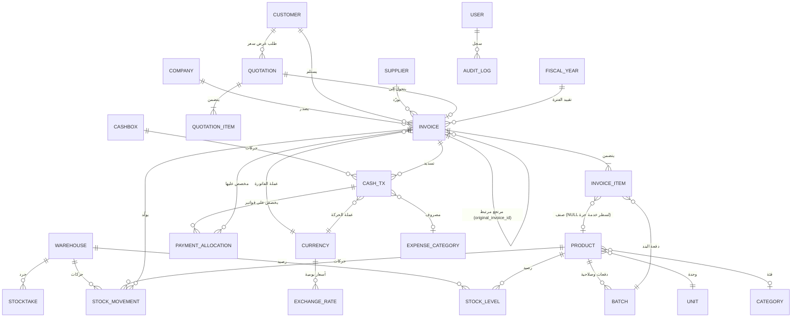

# وثيقة المواصفات الهندسية الكاملة (SRS) — الإصدار 1.5 (Flutter Edition)

> **تحديث الإصدار 1.5 (مواءمة البنية المعمارية والهوية الميدانية):** 
> 1. **إعادة ضبط النطاق الميداني**: تأجيل ميزات البيع بالتقسيط (الوحدة 05) والشيكات وتتبعها (الوحدة 14) إلى V1.1 لتسريع إطلاق المنظومة الأساسية، وتقديم تتبع الدفعات وتواريخ الصلاحية (FEFO / Batches — FR-01-10) وعروض الأسعار (Quotations — FR-02-11) إلى النطاق النشط V1.
> 2. **اعتماد بنية `mobile_app/` المحدثة**: ترقية الهيكل المعماري إلى نمط **Clean Architecture + MVVM** عبر الطبقات الصريحة (`lib/data/`, `lib/domain/`, `lib/ui/`) مع التوطين القياسي عبر `l10n.yaml` وملفات ARB.
> 3. **تثبيت الهوية البصرية الرسمية**: اعتماد خط **`Almarai` (المراعي)** محلياً كخط رسمي موحد للمنظومة مع الأرقام الجدولية `tabular-nums`، وثيم Material 3 بلون البذرة المالي (`Color(0xFF00695C)`).
> 4. **منظومة التطوير والمعاينة**: ربط حلقة المعاينة السريعة عبر `scripts/build-flutter-web.sh` التي تخدم تطبيق فلاتر حياً داخل إطار هاتف بلوحة التحكم على منفذ 3000، مع آليات الاستدامة في `mini-services/flutter-env/keeper.sh`.

## تطبيق «المُحاسِب الشخصي» — نظام محاسبي ومخزون متكامل لأجهزة الأندرويد

| البند | القيمة |
|---|---|
| **اسم الوثيقة** | وثيقة المواصفات الهندسية — التطبيق المحاسبي الشخصي (FinAcc) |
| **الإصدار** | **1.5 — النسخة النهائية المجمّدة للتنفيذ بـ Flutter (Frozen) — تحل محل v1.4 و v1.3** |
| **التاريخ** | 2026-10-06 |
| **الحالة** | ✅ معتمدة للتنفيذ — لا يُستأنف البناء إلا بهذه النسخة، ولا يُتخذ أي قرار معماري خارجها |
| **المنصة المستهدفة** | Android (أساسي) — قابل للتوسّع لاحقاً إلى Windows و Web و iOS من نفس الكود |
| **التقنية المعتمدة** | **Flutter 3.x+ و Dart 3.x+** + **Clean Architecture (Data / Domain / UI)** + **MVVM (Provider / ChangeNotifier)** + **sqflite / drift** + **go_router** + **خط Almarai** — تخزين محلي 100%، أوفلاين أولاً بلا استثناء (القسم 0.3) |
| **الهوية البصرية** | **حرية إبداعية كاملة للوكيل المنفّذ** ضمن عقد السلوك والوصول (القسم 6) مع توكنز وثيم Material 3 RTL |
| **بيئة التطوير** | مشروع Flutter القائم داخل **`mobile_app/`**؛ حلقة المعاينة الحية السريعة عبر الويب (`scripts/build-flutter-web.sh` على منفذ 3000) مع بيئة الـ sandbox المستدامة (`mini-services/flutter-env/keeper.sh`)؛ بوابات تدقيق Dart الصارمة؛ إنتاج APK أصلي مدمج عبر `flutter build apk` |
| **السوق المستهدف** | الجمهورية اليمنية (تعدد عملات: YER أساسية + SAR/USD/AED بأسعار صرف يومية) |
| **لغة الواجهة** | العربية فقط (RTL كامل) |
| **نموذج الاستخدام** | شخصي/فردي — جهاز واحد، مدير واحد + PIN — بلا اشتراكات أو شراء داخل التطبيق |
| **المرجع** | تحليل ثابت لـ«المحاسب المالي» v1.9.7 (المبني بـ Flutter أصلاً) + دليل الشاشات المرجعي (61 لقطة) |

> ## ⚖️ إعلان سلطة الوثائق (ملزم — يحكم كل تعارض)
>
> 1. **هذه الوثيقة (SRS v1.5) هي مصدر الحقيقة الوحيد والنهائي**: البنية، والتخطيط (Layout)، ونموذج البيانات، وقواعد العمل، والنطاق، والخطة.
> 2. **دليل الشاشات المرجعي مرجع للنصوص والمحتوى وإلهام بصري غير مُلزِم** — بنية كل شاشة محورية محكومة بـ §6.5، والهوية البصرية حرية الوكيل المنفّذ (§6.1).
> 3. عند أي تعارض: هذه الوثيقة مقدَّمة دائماً وفي كل شيء.

---

## 0. البنية الصارمة للمشروع (قوانين عليا لا تُخترق)

> هذا القسم **اعتمده صاحب المشروع حرفياً بتاريخ 2026-10-06**، وهو ملزم لكل مطور أو وكيل ذكاء اصطناعي أو أداة تعمل على هذا المشروع، ويقدَّم على أي نص آخر في الوثيقة عند التعارض. أي تعديل عليه يتطلب قراراً موثقاً من صاحب المشروع يُدمج مباشرة في نص هذا القسم.

### 0.1 هوية المشروع وحدوده العليا

- **الاسم**: FinAcc — «المُحاسِب الشخصي».
- **الشكل**: تطبيق Android واحد، جهاز واحد، **مدير واحد + PIN** (مستخدمون متعددون وصلاحيات تفصيلية → V1.1).
- **التخزين**: محلي 100% على الجهاز (SQLite) — **أوفلاين أولاً بلا استثناء**؛ لا ميزة واحدة في V1 تشترط شبكة.
- **السوق**: الجمهورية اليمنية — عربية RTL كاملة، عملة أساسية YER مع SAR/USD/AED بأسعار صرف يدوية يومية.
- **نطاق V1**: 14 وحدة وظيفية (القسم 4) — الوحدات المؤجلة ومواعيدها في القسم 11، ولا يجوز إعادة أي وحدة مؤجلة إلى V1 إلا بقرار موثق.

### 0.2 الأوامر وبنية المستودع القائم

- **مجلد المشروع**: **`mobile_app/`** — مشروع Flutter قائم ومبني ومتحقق منه بالكامل (Flutter 3.47+ / Dart 3.13+ مع معمارية Clean Architecture + MVVM وحزم `go_router` و `provider` ونظام التوطين الرسمي `l10n.yaml`) — **لا يُعاد إنشاؤه ولا يُغيّر مساره**.
- **التثبيت وإدارة الحزم**: `flutter pub get` داخل مجلد `mobile_app/`. الحزم الجديدة تُضاف مباشرة إلى `mobile_app/pubspec.yaml`.
- **حلقة البناء والمعاينة**: سكربت **`scripts/build-flutter-web.sh`** ينفذ بناء الويب السريع ويقوم بنشره في `public/mobile_app/` ليظهر التطبيق فوراً داخل إطار الهاتف التفاعلي في لوحة التحكم على `http://127.0.0.1:3000/` (التفصيل في 0.4).
- **استدامة بيئة الحاوية (Keeper)**: سكربت **`mini-services/flutter-env/keeper.sh`** و **`env.sh`** يضمنان استعادة Flutter SDK و Android SDK 36 وتفعيل متغيرات البيئة تلقائياً عند أي إعادة تشغيل لبيئة العمل.
- **بنية المجلدات داخل المشروع**: حسب القسم 8 (طبقات Clean Architecture: `lib/data/` للمستودعات ومحرك SQLite، و `lib/domain/` لكيانات وحالات استخدام النطاق، و `lib/ui/` للشاشات ونماذج العرض `view_models/`، و `lib/l10n/` لملفات ARB).
- **بوابة نهاية كل مهمة**: `dart format lib test` + `dart analyze` (صفر أخطاء وصفر تحذيرات في الوضع الصارم) + `flutter test` (التفصيل في 0.5).

### 0.3 الحزمة التقنية المعتمدة (ملزم)

- **قاعدة البيانات**: `sqflite` (أو `drift` المعتمد على محرك SQLite FFI) مع تفعيل وضع **WAL** دائماً — تخزين محلي 100%، أوفلاين أولاً بلا استثناء.
- **إدارة الحالة**: نمط **MVVM عبر `provider` و `ChangeNotifier`** (المهيأ في `mobile_app/pubspec.yaml`) مع `ListenableBuilder`، أو `flutter_riverpod` — فصل تام بين منطق العرض في `view_models/` ومنطق الأعمال المحاسبية.
- **التوطين واللغات**: التوطين الرسمي لفلاتر **`flutter_localizations`** + **`intl`** عبر `l10n.yaml` وتوليد `AppLocalizations` آلياً من ملفات ARB (`lib/l10n/app_ar.arb` و `app_en.arb`) مع دعم كامل لصيغ الجمع العربية.
- **الهوية والخطوط العربية**: خط **`Almarai` (المراعي)** مضمن محلياً في `mobile_app/assets/fonts/almarai/` لجميع النصوص، مع تفعيل خاصية الأرقام الجدولية (`fontFeatureSettings: ['tnum']`) لجميع المبالغ المالية.
- **الثيم ولوحة الألوان**: **Material 3** مع لون البذرة المالي المعتمد **`Color(0xFF00695C)` (Deep Teal / Emerald)** بوضعي الفاتح والداكن، وزوايا منحنية متناسقة (بطاقات 16dp وأزرار 12dp).
- **التنقل والمسارات**: **`go_router`** (المثبتة والمهيأة مسبقاً) — ملاحة تصريحية (Declarative Routing) ودعم الروابط العميقة وسهولة الاختبار.
- **التحقق من البيانات**: نماذج النطاق في Dart الصارمة (Domain Entities & Value Objects) مع التحقق الإلزامي من المدخلات ونمط `Result<T>` بدلاً من رمي الاستثناءات غير المنضبطة.
- **الطباعة الحرارية**: **`print_bluetooth_thermal`** + **`esc_pos_utils_plus`** (اتصال مباشر عبر البلوتوث BLE بطابعات الفواتير المحمولة لدعم الرستر وESC/POS).
- **توليد وطباعة PDF**: **`printing`** + **`pdf`** — قوالب فواتير وسندات PDF عربية دقيقة مع خطوط مدمجة ومشاركة عبر النظام.
- **مسح وتوليد الباركود**: **`mobile_scanner`** لقراءة الباركود وQR بالكاميرا، و **`barcode_widget`** لتوليد الأكواد على الشاشة والفواتير.
- **الأمان والتخزين المشفر**: **`flutter_secure_storage`** لحفظ المفاتيح ورمز PIN، و **`local_auth`** للبصمة كمسرّع أمان.
- **المشاركة والملفات**: **`share_plus`** للمشاركة الفورية (واتساب وغيره)، و **`path_provider`** و **`file_picker`** لإدارة ملفات النسخ وقواعد البيانات.
- **إكسل**: **`excel`** (Dart Native) لقراءة ملفات استيراد الأصناف والعملاء.
- **منع نوم الشاشة**: **`wakelock_plus`** لإبقاء شاشة نقطة البيع (الكاشير) نشطة أثناء العمل.
- **الأصوات والوسائط**: **`audioplayers`** لتشغيل نغمة `beep.wav` عند التقاط الباركود.

**جدول الحزم المعتمدة والممنوعة (قائمة نهائية):**

| الغرض | المعتمد في Flutter | الممنوع مع السبب |
|---|---|---|
| **قاعدة البيانات** | `sqflite` أو `drift` (محرك SQLite FFI أصلي مع WAL) | **Prisma** أو أي حلول سحابية تشترط شبكة |
| **إدارة الحالة** | `provider` / `ChangeNotifier` (MVVM) أو `riverpod` (مهيأة في `mobile_app/`) | خلط منطق الحالة داخل الـ Widgets مباشرة |
| **التنقل** | `go_router` (مهيأة مسبقاً في `mobile_app/`) | الملاحة اليدوية غير المنظمة (`Navigator.push` المباشر المتناثر) |
| **التحقق من المدخلات** | كلاسات Domain نقية بـ Dart الصارم مع دوال تحقق مركزية ونمط `Result<T>` | قبول مدخلات مالية دون تدقيق مسبق للأنواع والحدود |
| **الأيقونات** | `cupertino_icons` أو `Material Symbols` أو `lucide_icons` | أي حزم خارجية ثقيلة وغير متوافقة |
| **الباركود (توليد)** | `barcode_widget` (رسم متجهي أصلي لـ EAN-13 و QR) | حزم غير مصانة أو صور خارجية |
| **الباركود (قراءة)** | `mobile_scanner` (قراءة فورية عالية السرعة) | وحدات قديمة أو تتطلب إعدادات Native معقدة |
| **PDF/مشاركة** | `printing` + `pdf` + `share_plus` + `url_launcher` | توليد HTML خارجي معقد عبر WebViews |
| **الأمان** | `flutter_secure_storage` + `local_auth` | حفظ رموز السر أو PIN كنص عادي في التفضيلات |
| **ملفات/نسخ** | `path_provider` + `file_picker` + `share_plus` | مسارات ملفات غير قياسية |
| **إكسل** | `excel` (Dart Native) | أدوات تتطلب بيئة Node أو مفسرات خارجية |
| **الخطوط العربية** | خط **`Almarai` (المراعي)** بأوزانه الأربعة مضمن محلياً في `assets/fonts/almarai/` | تحميل الخطوط عبر الإنترنت وقت التشغيل (مخالف للـ Offline) أو خطوط بلا أرقام جدولية |
| **طباعة حرارية** | `print_bluetooth_thermal` + `esc_pos_utils_plus` | الحزم غير المتوافقة أو التي تتطلب جسوراً معقدة |

### 0.4 قوانين البيئة وحلقة العمل اليومية لوكيل Flutter

- **التطوير داخل مجلد `mobile_app/` حصراً**: كل كود يخص تطبيق فلاتر يقع داخل `mobile_app/`.
- **المعاينة الحية السريعة**: حلقة العمل المعتمدة للوكيل:
  **تعديل الكود → `flutter test` → `bash scripts/build-flutter-web.sh` → تحديث المعاينة في المتصفح** (حيث يظهر التطبيق حياً داخل إطار الهاتف على منفذ 3000 تحت مسار `/mobile_app/` وفي لوحة التحكم الرئيسية `/`).
- **استدامة البيئة**: ملفات `mini-services/flutter-env/keeper.sh` و `env.sh` تضمن بقاء البيئة جاهزة وتوفر الأدوات حتى بعد إعادة تشغيل الحاوية.
- **بناء حزمة أندرويد النهائية**: يتم عبر أمر واحد قياسي: `flutter build apk --release` لإنتاج APK مدمج وخفيف (25–35MB) جاهز للتثبيت على هواتف المستخدمين.
- **التحديث اللحظي (Hot Reload)**: عند تشغيل التطبيق في بيئة مدعومة، يتم الاعتماد على قاعدة `flutter-hot-reload.md` المجهزة في `.agents/rules/`.

**تفصيل حلقة العمل اليومية داخل الشريحة:**

```text
(1) تعديل الكود — داخل الشريحة الرأسية: UI أولاً ثم Domain ثم Data (القسم 9)
(2) flutter test                          # التحقق من سلامة كافة الاختبارات
(3) bash scripts/build-flutter-web.sh     # إعادة بناء حزمة الويب وتحديث المعاينة
(4) معاينة في المتصفح (إطار الهاتف على منفذ 3000) + فحص التفاعل وتناسق RTL
(5) تطبيق بوابات الجودة (0.5) قبل إنهاء المهمة
```

### 0.5 بوابات الجودة الإلزامية قبل إنهاء كل مهمة

| # | البوابة | معيار النجاح |
|---|---|---|
| 1 | `dart format lib test` | تنسيق قياسي نظيف دون أي تعديلات معلقة |
| 2 | `dart analyze` (أو `flutter analyze`) | **صفر أخطاء وصفر تحذيرات** في الوضع الصارم (`strict-casts`, `strict-inference`, `strict-raw-types`) |
| 3 | `flutter test` | **كافة اختبارات الوحدة والمكونات خضراء 100%** |
| 4 | `bash scripts/build-flutter-web.sh` | البناء ينجح والمعاينة تعمل بسلاسة في إطار الهاتف |
| 5 | فحص التباين ومساحات اللمس | مساحات اللمس ≥ 48×48dp وتباين الألوان ≥ 4.5:1 (المطابقة لمعايير Accessibility في أندرويد) |

> **لا تُغلق أي مهمة قبل اجتياز البوابات 1–4 على الأقل.** المهمة التي تمس منطق Domain تُغلق فقط بعد اجتياز البوابة 3 (اختبارات الوحدة) بنجاح كامل.

---
## 1. مقدمة الوثيقة

### 1.1 الغرض

توثّق هذه الوثيقة المتطلبات الوظيفية وغير الوظيفية، ومعمارية النظام، ونموذج البيانات، ومواصفات التصميم لتطبيق محاسبي عربي متكامل يُبنى من الصفر بواسطة **Flutter (Dart)**. الوثيقة مكتوبة بحيث تصلح مرجعاً مباشراً للمطوّر (أو لفريق تطوير أو وكيل ذكاء اصطناعي) دون حاجة لأي مستند إضافي: كل ميزة لها رقم متطلب قابل للتتبّع، وكل جدول قاعدة بيانات له مخطط SQL كامل، وكل شاشة لها وصف تفصيلي.

**طبيعة هذه الوثيقة**: نسخة مجمّدة قابلة للتنفيذ المباشر بلا أي قرار معلق — كل متطلب مرقّم، وكل سلوك قابل للضبط له مفتاح موثق في سجل الإعدادات (ملحق هـ)، وكل قاعدة عمل محسومة في موضعها (§5.4 والملاحق د–و). التنفيذ بشرائح رأسية UI→Domain→Data (القسم 9)، والهوية البصرية ملك الوكيل المنفّذ ضمن عقد السلوك (القسم 6).

### 1.2 النطاق

يُبنى التطبيق كبديل شخصي كامل الوظائف عن تطبيق «المحاسب المالي | فواتير مبيعات» الشهير. **نطاق V1** (المجمد في هذا الإصدار 1.5) يشمل 10 وحدات نشطة ومكتملة: **الفوترة وعروض الأسعار** (بيع/شراء/مرتجعات مرتبطة/عروض أسعار قابلة للتحويل الفوري)، **المخزون والدفعات** (مستودع واحد فاعلي، تتبع الدفعات وتواريخ الصلاحية FEFO)، **العملاء والموردون** (CRM بأرصدة متعددة العملات)، **الصناديق والنقدية** (بمسحوبات المالك وسندات القبض والصرف المرقّمة)، **العملات متعددة** (بفروق الصرف المحققة)، **التقارير المالية** (بأرباح مصححة عبر Posting Map)، **الطباعة والمشاركة** (حرارية وبلوتوث وPDF وواتساب)، **النسخ المحلي** (تشفير وضغط ومشاركة)، **الأمان** (مدير + PIN)، **الإعدادات وOnboarding**.

**مؤجل صراحة** (التفصيل والأسباب في القسم 11): البيع بالتقسيط والأقساط → V1.1؛ الشيكات وتتبعها → V1.1؛ الموظفون/الحضور/الرواتب → V1.1؛ المناديب والعمولات → V2؛ واجهة تحويل المخازن → V1.1/V1.2؛ النسخ السحابي Supabase → V1.1؛ SMS والصور المرفقة وQR الموقّع وHMAC والطابعات الشبكية → V2.

**يُستثنى** من النطاق كلياً: كل ما يتعلق بالترخيص التجاري (اشتراكات، شراء داخل التطبيق، تفعيل باقات، ربط جهاز) — التطبيق للاستخدام الشخصي فقط.

### 1.3 جمهور الوثيقة

- **المطوّر المنفّذ** (أنت أو أي مطوّر/وكيل مستقبلي): كل أقسام الوثيقة — ويبدأ إلزامياً من القسم 0.
- **أدوات التطوير المساندة بالذكاء الاصطناعي** (Cursor / Copilot / Claude): الوثيقة بصيغة Markdown قياسية تُغذّى مباشرة كمرجع سياق أثناء كتابة الكود، مع القسم 0 كقوانين عليا.

### 1.4 اصطلاحات الترقيم

- `FR-XX-YY`: متطلب وظيفي — XX رقم الوحدة، YY رقم المتطلب.
- `NFR-XX`: متطلب غير وظيفي. — `DS-XX`: بند مواصفات تصميم. — `AC-XX`: معيار قبول.
- كلمات الإلزام: **يجب** (إلزامي)، **ينبغي** (موصى به)، **يمكن** (اختياري).
- **قاعدة صياغة ملزمة**: يُمنع استخدام عبارات «حسب الإعداد / قابل للضبط / لو مفعّل / اختياري» إلا بمرجع صريح لمفتاح في **سجل الإعدادات (ملحق هـ)** الذي يحدد المفتاح والقيمة الافتراضية والنطاق والدور المصرّح له بالتغيير.

### 1.5 ملخص تنفيذي

يهدف المشروع إلى بناء نظام محاسبي عربي فائق الأداء يعمل **دون اتصال بالإنترنت بشكل أساسي (Offline-First بلا استثناء)**، يخزّن بياناته محلياً 100% في قاعدة **SQLite** على الجهاز عبر **sqflite / drift**، مع تحقق مالي صارم بالأنواع داخل كلاسات Dart Domain. النسخ الاحتياطي في V1 محلي بالكامل (ملف مضغوط يُشارك عبر النظام — واتساب/درايف)، والنسخ السحابي عبر Supabase خيار مؤجل إلى V1.1.

اعتُمد **Flutter & Dart** كإطار تقني رسمي لأنه يطابق تماماً البنية الأصلية المكتشفة للتطبيق المرجعي، ويمنحنا تصريفاً ثنائياً أصلياً (Native AOT) بسرعة 60–120 إطاراً في الثانية، مع دعم فوري ومباشر للطابعات الحرارية عبر البلوتوث (`print_bluetooth_thermal`) وتوليد الـ PDF، وحجم حزمة APK مدمج وخفيف (25–35MB).

**الخطة الزمنية المعتمدة (القسم 9)**: MVP بنهاية الأسبوع 8 (دورة بيع سليمة محاسبياً بالكامل)، **إصدار 1.0.0 في الأسبوع 13** لفرد واحد بدوام جزئي (3–4 ساعات/يوم)، والاتساع الكامل (الوحدات المؤجلة) بنهاية الأسبوع ~18 عبر إصدارات V1.1/V1.2.

---

## 2. المرجع الميداني (نتائج تحليل التطبيق الأصلي)

> حُلَّل التطبيق المرجعي «المحاسب المالي v1.9.7» تحليلاً ثابتاً: تفكيك حزمة ويندوز الرسمية (نفس كود نسخة الجوال) واستخراج **3,434 نصاً عربياً** وأسماء كيانات العمل من الكود المترجم، مع **61 لقطة شاشة** موثقة تحليلاً في «دليل الشاشات المرجعي» المرافق. الجدول أدناه يثبت خريطة الميزات وحكم النطاق لكل منها؛ وأي ميزة مذكورة هنا ولا توجد في نطاق V1 (القسم 1.2) فهي مؤجلة بموجب خارطة التأجيل (القسم 11). تقنيات المنافس لا تؤثر على بنائنا — مكافئاتها المعتمدة كلها في جدول الترجمة (3.4).

### 2.1 خريطة الميزات المؤكدة (من 3,434 نصاً عربياً مستخرجاً)

| الميزة | تكرار الكلمات الدالة | حكم الوثيقة (نطاق V1.3) |
|---|---|---|
| المخازن والمخزنية | 9 مواضع | وحدة FR-01 (رصيد لكل مخزن؛ واجهة التحويل → V1.1) |
| الطباعة والطابعات + البلوتوث | 16 موضعاً | وحدة FR-10 |
| العملات | 12 موضعاً | وحدة FR-08 (+ فروق الصرف) |
| الضريبة | 6 مواضع | مدمجة في الفوترة FR-02 (تقرير الضريبة → V1.1) |
| الصلاحيات | 5 مواضع | V1: مدير + PIN؛ التفصيلية → V1.1 |
| الأرباح | 5 مواضع | FR-09 بصيغة الملحق و (Posting Map) |
| التقسيط والأقساط | 8 مواضع | **→ V1.1** (مؤجلة لتسريع إطلاق الدورة التجارية الأساسية) |
| الدفعات وتواريخ الصلاحية | مؤكدة ميدانياً | وحدة FR-01-10 (أساسية V1 — تتبع الدفعات وصرف FEFO) |
| عروض الأسعار (Quotations) | مؤكدة ميدانياً | وحدة FR-02-11 (مهمة V1 — تسلسل QTE وتحويل فوري لفاتورة) |
| الشيكات وتتبعها | 12 موضعاً | **→ V1.1** (مؤجلة؛ تحصيل الشيك في V1 كحركة صندوق عادية) |
| النسخ الاحتياطي والسحابة | 6 مواضع | محلي FR-11؛ السحابي → V1.1 |
| الإرجاع/المرتجعات | 5 مواضع | FR-02-07 (مرتبط فقط في V1) |
| حضور الموظفين + السحبيات | 6 مواضع | **→ V1.1** (البديل: رواتب فئة مصروف) |
| واتساب | 3 مواضع | FR-10-02 |
| الباركود | 3 مواضع | مسح (mobile_scanner) + توليد (barcode_widget + EAN-13 يدوي) |
| التذكيرات | موضعان | FR-05-03 |
| تقرير يومي/شهري/سنوي | 9 مواضع | FR-09-09 |
| إكسل (استيراد/تصدير) | مؤكد بـ OpenXML | استيراد V1؛ التصدير الخام → V1.1 |

---

## 3. معمارية النظام المقترحة

### 3.1 نظرة عامة — Offline-First بلا استثناء

**القرار المعماري الجوهري: التطبيق يعمل محلياً أولاً — 100% من وظائف V1 بلا شبكة إطلاقاً** (قانون 0.3). قاعدة البيانات الأساسية هي SQLite على الجهاز نفسه، وكل الوظائف (فوترة، مخزون، تقارير، طباعة، نسخ) تعمل دون إنترنت. الإنترنت في V1 يُستخدم لوظيفة واحدة فقط: مشاركة ملفات PDF/النسخ عبر تطبيقات الجهاز (واتساب/درايف) — والمشاركة نفسها تتم عبر تطبيق الطرف الثالث المثبّت.

هذا القرار مبني على ثلاث حقائق:
1. **السوق اليمني** يعاني من انقطاع إنترنت متكرر، والتطبيقات المحاسبية هناك تعمل في محلات قد لا تملك إنترنت أصلاً.
2. **الخصوصية**: بياناتك المالية تبقى على جهازك، ولا طرف ثالث يراها.
3. **البساطة**: لا مصادقة سحابية ولا قواعد أمان شبكية — التطبيق شخصي بجهاز واحد ومدير واحد.

```
┌─────────────────────────────────────────────────────────────┐
│               Flutter 3.x+ (mobile_app/)                     │
│  ┌───────────────────────────────────────────────────────┐  │
│  │ UI Layer (Material 3 • RTL • Almarai • Color 0x00695C) │  │
│  │ Features Views • ViewModels (ChangeNotifier / MVVM)    │  │
│  │ Declarative Routing (go_router) • i18n (l10n.yaml)     │  │
│  └───────────────────────────────────────────────────────┘  │
│  ┌───────────────────────────────────────────────────────┐  │
│  │ Domain Layer (Pure Dart • Result<T> • No Framework)   │  │
│  │ Invoicing(Quotations) • Inventory(Batches/FEFO)       │  │
│  │ Financial Models • Posting Map • Period Lock          │  │
│  └───────────────────────────────────────────────────────┘  │
│  ┌───────────────────────────────────────────────────────┐  │
│  │ Data Layer (Repositories & Services & Storage)        │  │
│  │ Repositories Implementation • SQLite (sqflite/drift)  │  │
│  │ doc_sequence ذري • BLE Thermal • PDF • Scanner        │  │
│  └───────────────────────────────────────────────────────┘  │
└─────────────────────────────────────────────────────────────┘
```

### 3.2 قرار الخلفية السحابية — مؤجل إلى V1.1 (قرار نطاق)

**قرار النطاق**: V1 **بلا أي خلفية سحابية** — التخزين محلي 100% والنسخ ملف مضغوط يُشارك عبر النظام (FR-11). هذا يزيل من مسار الإطلاق: حساب خارجي، تشفير نقل، فشل شبكة، وواجهة إعداد — شبكة الأمان الكافية للأسابيع الأولى هي النسخة المحلية + المشاركة.

عند التنفيذ في V1.1، الخيار المعتمد **Supabase** (وليس Firebase): PostgreSQL يطابق عقلية SQLite المحلية، خطة مجانية تكفي لسنوات، حزمة supabase_flutter الرسمية التي تعمل مباشرة وبسلاسة مع فلاتر، تصدير كامل بملكية كاملة للبيانات، والنسخ Snapshot كامل يرفع إلى Supabase Storage بعد تشفيره محلياً AES-256.

### 3.3 قرار التنفيذ: قاعدة البيانات المحلية

- **المحرّك**: محرك SQLite الأصلي عبر **`sqflite`** أو **`drift`** (مع مشغّل FFI)، مع **تفعيل نمط WAL دائماً** لضمان أداء كتابة وقراءة فائق وتفادي أقفال الجداول.
- **طبقة الوصول والاستعلام**: مستودعات معمارية نظيفة (Repositories & DAOs) تُرجع كائنات ونماذج Dart آمنة للأنواع (Type-safe models)، مع إرجاع `Result<T>` لمعالجة الأخطاء بأمان.
- **التحقق**: كل عملية كتابة يتم تدقيقها عبر كلاسات النطاق (Domain Entities / Value Objects) قبل لمس قاعدة البيانات، مع إرجاع رسائل فشل عربية واضحة ومحددة.
- **الترقيم**: عبر جدول `doc_sequence` بـ **UPSERT ذري** (لا `MAX+1` أبداً — القاعدة 5.4-1).
- **التسمية**: أسماء الجداول بالإنجليزية snake_case، وكافة النصوص الظاهرة بالعربية عبر ثوابت وموارد التعريب المركزية.
- **الهجرات**: إدارة إصدارات المخطط عبر استراتيجية هجرات واضحة (Migrations) مسجلة برقم الإصدار — يسمح بترقية التطبيق وقاعدته دون فقدان أي بيانات. **الاستعادة من نسخة بمخطط أحدث من التطبيق تُرفض** برسالة واضحة (لا Downgrade).

### 3.4 حزمة التقنيات المعتمدة في Flutter (تطابق كامل ومباشر)

| الوظيفة | مكوّن المنافس (Flutter) | **الحزمة المعتمدة في مشروعنا (Flutter)** | ملاحظات وقيمة التنفيذ |
|---|---|---|---|
| **الإطار** | Flutter | **Flutter 3.x+** | تجميع AOT أصلي فائق السرعة بمحرك Impeller |
| **اللغة** | Dart | **Dart 3.x+** (مع Null Safety الصارم) | بوابة `dart analyze` الصارمة إلزامية |
| **التنقل** | go_router | **`go_router`** (مهيأة في `mobile_app/`) | توجيه تصريحي + Deep Linking |
| **واجهة المستخدم** | Material | **Material 3 (ThemeData RTL)** | دعم الوضعين الداكن والفاتح |
| **الأيقونات** | — | **`cupertino_icons` + Material Symbols / `lucide_icons`** | أيقونات خفيفة ومتوافقة |
| **إدارة الحالة** | — | **`provider` / `ChangeNotifier`** (أو `riverpod`) | نمط MVVM وفصل تام لمنطق العمل عن الواجهة |
| **التحقق** | — | **نماذج Dart Domain + نمط `Result<T>`** | تحقق مالي صارم قبل لمس القاعدة |
| **قاعدة البيانات** | sqlite3 (FFI) | **`sqflite` أو `drift` (محرك SQLite)** | تخزين محلي 100% مع نمط WAL |
| **الباركود قراءة** | — | **`mobile_scanner`** | قراءة فورية لكافة معايير EAN13/Code128/QR |
| **الباركود توليد** | — | **`barcode_widget`** + توليد EAN-13 | رسم متجهي دقيق للأكواد على الشاشة والفواتير |
| **الطابعة الحرارية** | thermal_printer | **`print_bluetooth_thermal` + `esc_pos_utils_plus`** | طباعة حرارية فورية عبر البلوتوث (رستر وESC/POS) |
| **PDF** | printing + pdfx | **`printing` + `pdf`** | توليد قوالب PDF عربية أصلية وعالية الدقة |
| **إكسل** | openxml يدوي | **`excel`** (Dart Native) | استيراد V1 للأصناف والعملاء؛ تصدير V1.1 |
| **الأمان الحيوي** | local_auth | **`local_auth`** | بصمة الأصبع والوجه كمسرّع للدخول |
| **تخزين مشفّر** | flutter_secure_storage | **`flutter_secure_storage`** | تغليف مفاتيح التشفير ورمز PIN |
| **إشعارات محلية** | flutter_local_notifications | **`flutter_local_notifications`** | تذكيرات الأقساط واستحقاقات الصرف |
| **مشاركة واتساب** | share_plus | **`share_plus` + `url_launcher`** | فتح محادثات `wa.me` ومشاركة الملفات مباشرة |
| **ملفات** | file_saver | **`path_provider` + `file_picker`** | إدارة وحفظ ملفات النسخ الاحتياطي محلياً |
| **صوت المسح** | flutter_soloud | **`audioplayers`** (تشغيل `beep.wav`) | تأكيد صوتي سريع وفوري عند المسح |
| **منع النوم** | wakelock_plus | **`wakelock_plus`** | إبقاء شاشة البيع نشطة أثناء وردية الكاشير |
| **الخطوط الرسمية** | — | **`Almarai` (المراعي)** مضمن في `assets/fonts/almarai/` | مقاييس منضبطة وأرقام جدولية للمبالغ (DS-18n) |

### 3.5 قيود ومزايا تقنية يجب معرفتها مسبقاً

1. **الطباعة الحرارية المباشرة**: مكتبة `print_bluetooth_thermal` تعمل بشكل أصلي ومباشر على هواتف أندرويد عبر البلوتوث وتتصل بكافة طابعات الفواتير المحمولة والمكتبية (58mm و 80mm).
2. **الطباعة العربية الحرارية**: طابعات ESC/POS الرخيصة الشائعة في اليمن (Xprinter, POS-58, Sunmi) يتم دعمها كالتالي:
   - **الطباعة كصورة نقطية (Raster)**: تحويل الفاتورة أو الإيصال إلى صورة نقطية أحادية اللون عبر مكتبة `image` ثم إرسالها للطابعة (وهذا مضمون 100% لكافة الطابعات بلا استثناء).
   - **أوامر ESC/POS النصية**: للأرقام والإنجليزية والنصوص البسيطة للسرعة العالية.
3. **حجم التطبيق الخفيف**: حجم ملف APK المتوقع هو **25–35MB** فقط (مطابق تماماً لتطبيق المنافس 28MB) بفضل تجميع Dart AOT، خلافاً للمحركات الثقيلة.
4. **الأداء**: كل عمليات القاعدة تجري عبر فهارس محددة في المخطط (5.3)؛ الحسابات التجميعية (التقارير) عبر استعلامات SQL مجمعة، واستخدام Dart Isolates في العمليات الحسابية الكبيرة لضمان بقاء الواجهة عند 60–120 إطاراً في الثانية. مقياس الأداء الموحد: NFR-01/NFR-03/AC-22 (50,000 فاتورة / 100,000 حركة).
5. **قوانين بيئة الوكيل**: موثقة كقوانين عليا في القسم 0.4 (التطوير داخل `mobile_app/`، واستخدام سكربت معاينة الويب السريعة `scripts/build-flutter-web.sh`، واجتياز بوابات `dart analyze` و `flutter test`).

### 3.6 حالة المشروع الحالية (جاهزية مجلد `mobile_app/`)

مشروع Flutter قائم ومبني ومتحقق منه بالكامل داخل مجلد **`mobile_app/`** وفق معمارية Clean Architecture + MVVM القياسية:
- تم تثبيت وتهيئة `go_router` و `provider` و `flutter_lints` وضبط نمط التحليل الصارم، مع دعم التوطين القياسي عبر `l10n.yaml` وتوليد `AppLocalizations`.
- تم تجهيز وإثبات حلقة المعاينة الحية السريعة عبر الويب: سكربت **`scripts/build-flutter-web.sh`** الذي يقوم ببناء التطبيق ونشره في `public/mobile_app/` ليعمل حياً داخل إطار هاتف تفاعلي في لوحة التحكم على منفذ 3000، مع التحقق من استجابة الـ MVVM عبر المتصفح.
- تم تجهيز بيئة الحاوية بآلية استدامة ذكية: **`mini-services/flutter-env/keeper.sh`** و **`env.sh`** لإعادة توفير Flutter SDK 3.47.6 و Android SDK 36 تلقائياً عند أي إعادة إقلاع للحاوية.
- المتبقي للانطلاق في الشريحة 0 والشريحة 1: تثبيت حزم التخزين المحلي `sqflite` / `drift` وتأسيس جداول DDL (القسم 5.3) ومستودعات البيانات، وتضمين خط `Almarai` محلياً، وبناء شاشات Onboarding وتثبيت الهوية البصرية.

---

## 4. المتطلبات الوظيفية — FR

> كل متطلب مرقّم وقابل للاختبار، وتُحوَّل إلى قائمة مهام مباشرة. كل موضع مؤجل يعلَّم بوضوح ويُشار إلى خارطة التأجيل (القسم 11). عمود «النطاق» يعني: **V1** (يُبنى الآن) أو **V1.1/V1.2/V2** (مؤجل بقرار مراجعة النطاق).

### الوحدة 01 — الأصناف والمخزون (Inventory)

**الوصف العام**: إدارة كاملة للأصناف من تعريفها حتى جردها، مع تتبّع الكميات لكل مخزن على حدة (واجهة V1 تشغّل مستودعاً واحداً فاعلياً — بنية تعدد المخازن باقية في البيانات)، وتسعير بعملات متعددة بمستوى `retail` في V1.

| الرمز | المتطلب | الأولوية | النطاق |
|---|---|---|---|
| FR-01-01 | **يجب** أن يُضاف صنف بالحقول: اسم (عربي، إلزامي)، باركود (فريد إن أُدخل — يبقى محجوزاً بعد الأرشفة)، فئة، وحدة قياس، سعر تكلفة، سعر بيع لكل عملة مفعّلة (مستوى `retail` — قرار 5)، كمية افتتاحية، حد أدنى للتنبيه، ملاحظات، صورة (اختياري)، وعلم `is_service` (صنف خدمي بلا مخزون) | أساسية | V1 |
| FR-01-02 | **يجب** توليد باركود EAN-13 يدوياً للصنف عند ترك الحقل فارغاً، مع دعم توليد رمز QR عبر barcode_widget | أساسية | V1 |
| FR-01-03 | **يجب** دعم مسح الباركود بالكاميرا (mobile_scanner) مع صوت «بيب» عند القراءة الناجحة وفتح شاشة الصنف فوراً — من أي شاشة عبر زر مسح عائم؛ الصنف المؤرشف لا يظهر في نتائج المسح | أساسية | V1 |
| FR-01-04 | **يجب** دعم البحث الفوري بالاسم أو الباركود (LIKE مفهرس) بنتائج < 100ms لقاعدة 10,000 صنف | أساسية | V1 |
| FR-01-05 | **يجب** إدارة فئات الأصناف (شجرة بعمق مستويين) ووحدات القياس مع **تحويل الوحدات** (1 كرتون = 24 قطعة) | مهمة | V1 |
| FR-01-06 | **يجب** أن يحمل كل صنف رصيداً مستقلاً لكل مخزن، وتعرض شاشة المخزون الرصيد الكلي + رصيد كل مخزن | أساسية | V1 |
| FR-01-07 | **يجب** تسجيل كل حركة مخزون في `stock_movements` مرجعي لا يُحذف، بأنواع: شراء، بيع، مرتجع بيع، مرتجع شراء، **تسوية جرد (stocktake_adjust)، تعديل يدوي (manual_adjust)** (منفصلان للتمييز في خريطة الترحيل)، تحويل وارد/صادر، افتتاحي | أساسية | V1 |
| FR-01-08 | **يجب** دعم **الجرد**: شاشة جرد للمخزن المحدد تعرض الرصيد الدفتري وإدخال الرصيد الفعلي، وتولّد تسوية الفرق كحركة جرد موقّعة بتاريخ المستخدم واسم الجانِد **وبتكلفة لقطة (unit_cost) وقت الجرد** | مهمة | V1 |
| FR-01-09 | **يجب** دعم تحويل المخزون بين المخازن (من مخزن إلى مخزن آخر بكمية وملاحظة — **يُرفض التحويل لنفس المخزن** برسالة واضحة) | مهمة | **V1.1** (البنية في DDL جاهزة) |
| FR-01-10 | **يجب** دعم **الدفعات (Batch) وتواريخ الصلاحية** بتتبّع FEFO (First-Expired, First-Out): ربط بنود الشراء والبيع برقم الدفعة وتاريخ الصلاحية، وتنبيه الأصناف القريبة من الانتهاء، وتوليد أسطر متعددة آلياً عند امتداد الكمية المباعة على أكثر من دفعة | أساسية | V1 |
| FR-01-11 | **يجب** تحديث أسعار البيع بجميع العملات تلقائياً عند تغيير سعر الصرف (هامش `inventory.auto_price_margin` لكل عملة) مع سجل أسعار كامل قبل/بعد (`product_price_history`) | مهمة | **V1.1** |
| FR-01-12 | **يجب** تنبيه الرصيد الأدنى: صنف يهبط رصيده الكلي تحت حده الأدنى يظهر في شاشة «تنبيهات المخزون» بإشعار محلي يومي 9 صباحاً لو كان الإعداد `inventory.min_stock_alert` مفعّلاً | مهمة | V1 |
| FR-01-13 | **يجب** دعم استيراد أصناف من Excel/CSV: اختيار الأعمدة المطابقة قبل الاستيراد + تقرير بالصفوف الناجحة/الفاشلة **بأسبابها** — **لا يُدخل أي صف جزئياً دون إقرار صريح** (AC-14) | مهمة | V1 |
| FR-01-14 | **يجب** أن تُعرض أصول الصنف كالتاريخ المعدّل والتعديلات (سجل تدقيق) | ثانوية | V1 |
| FR-01-15 | **يجب** منع حذف صنف له حركات — البديل: أرشفة (يختفي من القوائم الجديدة والمسح ويبقى في التقارير) | أساسية | V1 |
| FR-01-16 | **يجب** دعم **الأصناف الخدمية** (`is_service=1`): بلا حركات مخزون ولا رصيد — تدخل في الفواتير بلا أثر مخزوني، مع دعم **سطور خدمة حرة** في الفاتورة (`invoice_item.product_id` NULLable + وصف السطر) | أساسية | V1 |

### الوحدة 02 — الفوترة (Invoicing) — قلب التطبيق

**الوصف العام**: فواتير بيع/شراء/مرتجع مرتبط، بأنواع دفع (نقدي/آجل/مختلط) وحالة مستند (draft/completed/void) وفق **آلة الحالات الملزمة (تفصيلها جدولاً في 5.4-2)**، بترقيم تلقائي ذري وتأريخ مضبوط، تعمل بلا إنترنت وتحدّث المخزون والصناديق والحسابات آلياً داخل Transaction واحدة.

| الرمز | المتطلب | الأولوية | النطاق |
|---|---|---|---|
| FR-02-01 | **يجب** إنشاء فاتورة بيع بالحقول: **رقم تسلسلي تلقائي دائماً** `INV-YYYY-NNNNN` عبر `doc_sequence` (لا تحرير يدوي للرقم، لا إعادة استخدام — قرار 6)، التاريخ قابل للتعديل **ضمن 30 يوماً رجوعاً** (`dating.max_backdate_days`) وما بعدها يتطلب تأكيد المدير + قيد audit (FR-02-19)، العميل، الصندوق، العملة وسعر صرف يومها، البنود؛ حقل المندوب محجوز (V2) | أساسية | V1 |
| FR-02-02 | **يجب** أن يُضاف بند للفاتورة عبر: مسح باركود (الكمية 1 + ضغطة تعيد المسح)، بحث اسم، أو **ItemPickerSheet** (شبكة أول 20 صنفاً حسب الأكثر مبيعاً، نقرة واحدة تضيف بكمية 1). مع تعديل الكمية/السعر/الخصم لكل بند وحساب الإجمالي لحظياً، **وعرض «المتاح: N» في سطر البند** بلون تحذيري عند تجاوز الكمية للمتاح، وتحذير لحظي بخيار «إضافة كموجود» أو «متابعة» حسب إعداد `sale.over_avail_policy` | أساسية | V1 |
| FR-02-03 | **يجب** دعم أنواع الدفع الثلاثة: **نقدي** (يسدد فوراً من الصندوق عبر PaymentSheet — DS-40)، **آجل** (على حساب العميل بعملة الفاتورة)، **مختلط** (دفعتان: جزء نقدي وجزء آجل — بعملة واحدة). **وتُحفظ الفاتورة المعلقة كمسودة `status='draft'`**: مستند بلا رقم ولا أثر مالي/مخزوني حتى تحويلها | أساسية | V1 |
| FR-02-04 | **يجب** دعم ضريبة القيمة المضافة: نسبة `company.tax_rate` (0% افتراضياً لليمن)، طريقة الحساب حسب إعداد `invoicing.tax_mode` (لكل بند / على الإجمالي — افتراضي: على الإجمالي)، وتظهر مفصّلة في الفاتورة | أساسية | V1 |
| FR-02-05 | **يجب** دعم الخصومات: خصم على البند (% أو مبلغ) وخصم على إجمالي الفاتورة، **مع منع صافي الفاتورة ≤ 0** (رسالة واضحة)، ومنع الخصم تحت هامش الربح عند تفعيل `invoicing.discount_below_margin` (افتراضي: معطل) | مهمة | V1 |
| FR-02-06 | **يجب** أن تُخصم الكميات من المخزون المحدد **فور الحفظ المكتمل** (`status='completed'`) داخل **Transaction ذرّية واحدة** (فاتورة + بنود + حركات مخزون + أرصدة + حركات صندوق + تخصيصات) — فشل أي خطوة يرجع الكل. الحفظ كمسودة (draft) لا يخصم شيئاً | أساسية | V1 |
| FR-02-07 | **يجب** دعم فاتورة **مرتجع بيع مرتبطة بفاتورة أصلية فقط** في V1 (`original_invoice_id` — يغلق ثغرة المرتجع الحر): إعادة الكمية للمخزون **بتكلفة `line_cost` الأصلية** (لا WAC الجاري)، وقيود: مجموع مرتجعات الفاتورة ≤ المباع لكل بند، ومنع المرتجع لفاتورة ملغاة، واتجاه إرجاع المبلغ: نقدي من الصندوق أو خصم من حساب العميل | أساسية | V1 |
| FR-02-08 | **يجب** دعم فاتورة **شراء** و**مرتجع شراء** باتجاه معاكس: إضافة مخزون، دفع من الصندوق/حساب المورّد؛ **خصم رأس فاتورة الشراء يوزَّع على البنود نسبةً لقيمتها قبل تحديث WAC** (قاعدة 5.4-3)؛ **مرتجع الشراء يخرج بسعر حركة الشراء الأصلية (Snapshot)** ويعاد حساب WAC على المتبقي | أساسية | V1 |
| FR-02-09 | **يجب** دعم الفواتير بعملات متعددة: كل فاتورة تُخزَّن بعملتها وسعر صرفها وقت الإصدار (Snapshot)، والتقارير تُجمَّع بعملة التقرير المختارة بالتحويل بسعر يوم كل حركة | أساسية | V1 |
| FR-02-10 | **يجب** دعم **الدفعتين في فاتورة واحدة** (نصف نقدي ونصف آجل — `mixed` بعملة واحدة): جزء نقدي من الصندوق وجزء آجل على الحساب. عند دفع الجزء النقدي بعملة مختلفة عن عملة الفاتورة: تُسجَّل حركة الصندوق **بعملة الصندوق وبسعر لحظة الدفع** ويُحسب الفرق في `fx_gain_loss` | مهمة | V1 |
| FR-02-11 | **يجب** دعم **عرض السعر (Quotation)**: مستند كالفاتورة غير ملزم، بترقيم تسلسلي تلقائي مستقل `QTE-YYYY-NNNNN` عبر `doc_sequence`، يحمل تاريخ انتهاء صلاحية العرض، وقابل للتحويل بضغطة واحدة إلى فاتورة مبيعات (مكتملة أو مسودة) مع حفظ المرجع المتبادل (`quotation_id` / `converted_invoice_id`) وتغيير حالته إلى `converted` | مهمة | V1 |
| FR-02-12 | **يمكن** دعم QR بتحقق HMAC (رقم + إجمالي + تاريخ موقّعة) للتحقق من نسخة ويب مستقبلية | ثانوية | **V2** |
| FR-02-13 | **يجب** دعم **تعليق السلة (Park)**: أثناء البيع تُحفظ السلة جانباً **في storage محلي (ليست مستنداً — لا رقم ولا صف invoice)**، والعودة إليها من شريط «المعلّقات» (Chip ظاهر عند وجود معلّقات). **وتُحفظ مسودة السلة تلقائياً عند كل تغيير** (throttled) وتُستعاد بعد أي انهيار مع Banner «تمت استعادة فاتورتك غير المحفوظة» (AC-23) | مهمة | V1 |
| FR-02-14 | **يجب** دعم الطباعة الفورية عند الحفظ حسب إعداد `invoicing.print_on_save` (طبعة/لا تطبع/اسأل — افتراضي: اسأل) والمشاركة عبر واتساب (الوحدة 10) | أساسية | V1 |
| FR-02-15 | **يجب** دعم **إلغاء فاتورة مكتملة (void)**: بصلاحية المدير فقط، ينشئ **حركات معاكسة كاملة** (مخزون + صندوق + أرصدة — لا حذف فيزيائي) + قيد audit؛ الفاتورة الملغاة تبقى ظاهرة بحالة «ملغاة» ولا يُعاد استخدام رقمها؛ لا إلغاء لفاتورة مرتجع مرتبطة بها مرتجعات (يُلغى المرتجع أولاً) | أساسية | V1 |
| FR-02-16 | **يجب** دعم ملاحظة نصية داخلية بالفاتورة (لا تطبع) وأخرى خارجية (تطبع) | ثانوية | V1 |
| FR-02-17 | **يمكن** دعم صور مرفقة بالفاتورة (صورة شيك مثلاً) | مؤجل | **V2** |
| FR-02-18 | **يجب** أن يتم **تحويل المسودة (draft) إلى مكتملة** داخل Transaction ذرّية واحدة: استهلاك الرقم من `doc_sequence` + التحقق من الرصيد المتاح وقت التحويل (وقت الإصدار لا وقت الإنشاء) + الخصم المخزوني + حركات الصندوق — **وعند نقص المخزون يُرفض التحويل برسالة تسمّي الصنف والكمية الناقصة بالتحديد** (نموذج الرسالة في 6.3) | أساسية | V1 |
| FR-02-19 | **يجب** فحص **قفل الفترات** (`assertPeriodOpen`) في كل مسار كتابة بتاريخ (invoice/cash_tx/stock_movement/stocktake/installment): أي تاريخ داخل سنة مغلقة في `fiscal_year` يُرفض؛ والتأريخ الرجعي > 30 يوماً يتطلب تأكيد المدير + قيد audit؛ `issued_at` عند التحويل = تاريخ التحويل (مع حفظ `converted_at` للأرشفة) | أساسية | V1 |
| FR-02-20 | **يجب** أن يُعرض على الفاتورة التي استُخدم فيها سعر صرف احتياطي (`rate_is_fallback=1`) **شارة ظاهرة** «سعر صرف تقديري» في الشاشة والطباعة | أساسية | V1 |

### الوحدة 03 — العملاء والموردون (CRM)

| الرمز | المتطلب | الأولوية | النطاق |
|---|---|---|---|
| FR-03-01 | **يجب** إدارة ملف عميل: اسم (إلزامي)، هاتف (مع تأكيد وجوده لاستخدام واتساب)، عنوان، **حد ائتمان بمعنى محسوم: NULL = بلا حد، 0 = منع الآجل كلياً**، **رصيد افتتاحي بعملته وسعره وتاريخه** (`opening_balance_currency_id` + `as_of_rate` + تاريخ)، ملاحظات، صورة | أساسية | V1 |
| FR-03-02 | **يجب** حساب رصيد العميل تلقائياً **لكل عملة على حدة** بالمعادلة: **رصيد = Σ(مديونية آجلة) − Σ(تحصيلات) − Σ(مرتجع بيع آجل) + رصيد افتتاحي** — مع كشف حركات كامل، وتوثيق حالة «مرتجع بعد دفع نقدي = رصيد دائن لصالح العميل» (تقرير أرصدة دائنة — FR-09-14). **ويُختبر باختبار وحدة يطابق AC-02 حرفياً** | أساسية | V1 |
| FR-03-03 | **يجب** إدارة مورّدين بنفس البنية (رصيد لصالح/على المورّد) وبأرصدة افتتاحية بعملتها | أساسية | V1 |
| FR-03-04 | **يجب** شاشة كشف حساب: كل حركات الطرف (فواتير، تحصيلات، مرتجعات، شيكات) خلال فترة مختارة **بعملة الكشف المختارة** مع رصيد رأسي متحرك، قابل للتصدير PDF وإرساله واتساب — **الكشف بالعملة الواحدة يتوازن دائماً** (فروق الصرف لا تدفن فيه — FR-08-10) | أساسية | V1 |
| FR-03-05 | **يجب** تنبيه حد الائتمان عند بيع آجل يتجاوز الحد، بسلوك إعداد `parties.credit_limit_action` (**افتراضي: تحذير**) | مهمة | V1 |
| FR-03-06 | **يجب** تذكيرات الديون: تذكير واتساب يدوي بضغطة (wa.me برسالة جاهزة تتضمن الرصيد بعملته) + قائمة «أعمال متعثرة»: عملاء رصيدهم > 0 **مرتبين تصاعدياً بأقدم فاتورة آجلة غير مسددة** مع عمود «متأخر منذ X يوماً» | مهمة | V1 |
| FR-03-07 | **يجب** تجميع العملاء حسب منطقة/تصنيف | ثانوية | **V1.1** (مع المناديب) |
| FR-03-08 | **يجب** استيراد عملاء من Excel/CSV بنفس آلية FR-01-13 (تقرير فاشل + لا إدخال جزئي دون إقرار) | ثانوية | V1 |
| FR-03-09 | **يجب** منع حذف طرف له حركات — أرشفة فقط (حذف الدفعة عند المنافس = **أرشفة دفعة** عندنا) | أساسية | V1 |

### الوحدة 04 — الصناديق والنقدية (Cash)

| الرمز | المتطلب | الأولوية | النطاق |
|---|---|---|---|
| FR-04-01 | **يجب** دعم **صناديق متعددة** لكل منها رصيد وعملة افتراضية، وصندوق افتراضي مرتبط بالإعدادات | أساسية | V1 |
| FR-04-02 | **يجب** تسجيل حركات الصندوق بأنواع: قبض (تحصيل/سند قبض)، صرف (دفع لمورّد/سند صرف)، مصروف، **مسحوبات مالك (owner_draw)**، **إيداع مالك (capital_in)**، إيداع/سحب بنكي، تحويل بين صندوقين، فتح/إقفال وردية. (سحبية موظف وعمولة مندوب وصرف مسير: قيم محجوزة في DDL حتى V1.1/V2 — بديل V1: الراتب مصروف بفئة «رواتب») | أساسية | V1 |
| FR-04-03 | **يجب** أن يرتبط كل نوع حركة بمرجعه: تحصيل ← فاتورة/قسط/تخصيص، مصروف ← فئة مصروف، ويُدعم **القبض على الحساب** (`ref_type='on_account'` — دفعة بلا فاتورة محددة تخصم FIFO من الأقدم) | أساسية | V1 |
| FR-04-04 | **يجب** شاشة **إقفال الوردية** بالمعادلة الشاملة: **المتوقع = Σ كل الوارد خلال النافذة (مبيعات نقدية + تحصيلات + إيداعات مالك + تحويلات واردة + إيداعات بنكية + شيكات محصّلة) − Σ كل الصادر (مدفوعات موردين + مصاريف + مسحوبات مالك + تحويلات صادرة + سحب بنكي + شيكات مصروفة محصّلة)** — مقارنةً بالعد الفعلي المُدخل، مع تسجيل الفرق (زيادة/عجز) وحفظ تقرير الوردية PDF | مهمة | V1 |
| FR-04-05 | **يجب** دعم فئات المصاريف مع فئة **«رواتب» افتراضية** (بديل وحدة الموظفين المؤجلة) وتقرير مصاريف لكل فئة/فترة | أساسية | V1 |
| FR-04-06 | **يجب** حساب «الصندوق الحالي» لحظياً في الشاشة الرئيسية لكل صندوق — **بالسماح بالسالب مع تحذير بصري واضح** (FR-04-09) | أساسية | V1 |
| FR-04-07 | **يجب** دعم عملة لكل صندوق: التحويل بين صندوقين بعملتين مختلفتين يُسجَّل **بسعر صرف لحظة التحويل** ويُحسب الفرق في `fx_gain_loss` ويظهر بنداً في الأرباح | مهمة | V1 |
| FR-04-08 | **يجب** سجل تدقيق كامل لكل حركات الصندوق — **لا حذف ولا تعديل: حركة معاكسة** (`is_voided` + `reversal_of`) بصلاحية المدير + قيد audit | أساسية | V1 |
| FR-04-09 | **يجب** السماح برصيد صندوق **سالب** مع تحذير بصري وقت التسجيل وظهور بند **«عجز صندوق»** في تقرير الوردية (منع التسجيل يولّد بيانات أسوأ: حيَلاً وتأجيلاً قذراً). منع السالب يبقى **مطلقاً في المخزون فقط** | أساسية | V1 |
| FR-04-10 | **يجب** دعم **السند المرقّم المطبوع**: كل قبض/صرف يطبعه المستخدم يحمل رقماً تسلسلياً مستقلاً `RVT-YYYY-NNNNN` / `PMT-YYYY-NNNNN` عبر `doc_sequence` (يُستهلك عند الطباعة الأولى) + قالب طباعة موحد فوق `cash_tx` — بلا كيان مستقل (الكيان الكامل → V1.1) | مهمة | V1 |

### الوحدة 05 — التقسيط (Installments) — ⏸ مؤجلة إلى V1.1

> **قرار نطاق (القسم 11)**: أُجلت وحدة البيع بالتقسيط بكافة شاشاتها وجداولها المنطقية إلى الإصدار V1.1 للتركيز على إتقان الدورة التجارية الأساسية والتسعير والدفعات وتواريخ الصلاحية. لا تتضمن واجهات V1 شاشات لإنشاء خطط التقسيط أو تحصيل الأقساط، ويتم تسجيل مديونيات العملاء كحسابات آجلة عادية (AR) في كشف الحساب. الجداول DDL تبقى محجوزة لهجرات V1.1 دون بناء واجهات لها في V1.

| الرمز | المتطلب | الأولوية | النطاق |
|---|---|---|---|
| FR-05-01 | **يجب** تحويل **فاتورة آجلة فقط** إلى خطة تقسيط (عدد أشهر/أسابيع، دفعة أولى ≤ إجمالي الخطة، تاريخ أول قسط، دورية) بتوليد الجدول تلقائياً وفق **قاعدة التقريب**: أقساط متساوية مقربة لأقرب وحدة والفرق على القسط الأخير | أساسية | **⏸ V1.1** |
| FR-05-02 | **يجب** شاشة «الأقساط المستحقة اليوم/هذا الأسبوع» مع تحصيل قسط بضغطة (يسجّل قبضاً في الصندوق ويخصم من الرصيد **بعملة الخطة**) | أساسية | **⏸ V1.1** |
| FR-05-03 | **يجب** تذكير آلي بقسط العميل قبل الاستحقاق بيوم (إشعار محلي حسب إعداد) + زر «تذكير واتساب» (رسالة جاهزة: القسط والتاريخ والرصيد) | مهمة | **⏸ V1.1** |
| FR-05-04 | **يجب** إدارة التعثر: القسط الذي حالته pending/partial وتاريخ استحقاقه < اليوم يُعرض بدلالة تحذيرية موحّدة وشارة **«متأخر X يوماً»** | مهمة | **⏸ V1.1** |
| FR-05-05 | **يجب** تقرير «الأقساط»: المحصّل، المستحق، المتأخر، المتوقع شهرياً (تدفق نقدي) | مهمة | **⏸ V1.1** |
| FR-05-06 | ربط خطة التقسيط بعمولات المناديب | ثانوية | **V2** |
| FR-05-07 | **يمكن** دفع قسط مقدماً (تعجيل) — يُسجل كرصيد دفعات يستهلكه القسط التالي | ثانوية | **⏸ V1.1** |

---
### الوحدة 06 — المناديب والعمولات (Sales Reps) — ⏸ مؤجلة بالكامل إلى V2

> **قرار نطاق (القسم 11)**: نموذج «جهاز واحد شخصي» لا يخدم مندوباً ميدانياً أصلاً، والعمولات تحمل أعقد الحالات الحدية (clawback عند المرتجع، عمولة 'both' المزدوجة، عملة الصرف). **لا يُبنى من هذه الوحدة شيء في V1** — عمود `invoice.sales_rep_id` يبقى موجوداً (NULLable، بلا FK) كاستثمار هيكلي فقط، وجدولا `sales_rep`/`commission` مؤجلان وفق خارطة التأجيل. تُعاد صياغة المتطلبات الأصلية (FR-06-01→06-05) عند التنفيذ مع قرارات Clawback والعملة الموثقة هناك.

### الوحدة 07 — الموظفون وشؤونهم (HR) — ⏸ مؤجلة بالكامل إلى V1.1

> **قرار نطاق (القسم 11)**: أكبر خفض مفرد في الخطة (~3 أسابيع) — تكرار شهري لا يومي، والمراجعة المحاسبية كشفت ازدواج خصم السلف (رقم حر بلا جدول ربط) يحتاج تصميماً هادئاً. **البديل الموثق في V1**: الراتب مصروف بفئة «رواتب» (FR-04-05)، وسلفة الموظف = مصروف عادي أو مسحوبة مالك حسب الحالة. جدولا `employee`/`attendance`/`salary_period` مؤجلة، وقيم `tx_type` المحجوزة (`employee_advance`/`salary_batch`) لا تُستخدم حتى V1.1. عند التنفيذ تُطبق إلزامياً: جدول `advance_deduction` بقيود UNIQUE، قاعدة خصم اليوم (`salary/30`)، سقف الخصم بصافي الراتب، تجميد الحضور عند صرف المسير، وصيغة period تشمل الدورة.

### الوحدة 08 — العملات وأسعار الصرف (Multi-Currency) — مع فروق الصرف الجديدة

| الرمز | المتطلب | الأولوية | النطاق |
|---|---|---|---|
| FR-08-01 | **يجب** أن تكون العملة الأساسية **الريال اليمني (YER)** قابلة للتغيير في الإعداد الأول فقط (تثبيت بعده)، مع `decimals=0` افتراضياً لليمني | أساسية | V1 |
| FR-08-02 | **يجب** إدارة عملات إضافية (SAR، USD، AED…) برمز واسم ورمز SVG مضمّن | أساسية | V1 |
| FR-08-03 | **يجب** إدخال **سعر صرف يدوي لكل يوم** (لا يوجد API موثوق للريال اليمني) مع سجل تاريخي كامل لكل عملة | أساسية | V1 |
| FR-08-04 | **يجب** تذكير يومي (إشعار محلي 9 صباحاً حسب إعداد `fx.daily_reminder` — افتراضي مفعّل): «حدّث أسعار الصرف اليوم» إن لم تُدخل | ثانوية | V1 |
| FR-08-05 | **يجب** أن تستخدم كل فاتورة/حركة سعر صرف يومها المخزّن (Snapshot) ولا تتأثر بتغيّر الأسعار لاحقاً | أساسية | V1 |
| FR-08-06 | تحديث أسعار بيع الأصناف بجميع العملات عند تغيّر سعر الصرف (بهامش لكل عملة) | مهمة | **V1.1** (مع FR-01-11) |
| FR-08-07 | **يجب** أن تتيح التقارير اختيار «عملة التقرير» فتُجمَّع الأرقام بالتحويل بسعر صرف تاريخ كل حركة | أساسية | V1 |
| FR-08-08 | **يجب** عرض أسعار البيع بجميع العملات في شاشة الصنف وشاشة البيع (بطاقة سعر لكل عملة — مستوى retail) | مهمة | V1 |
| FR-08-09 | **يجب** تطبيق **سياسة سعر الصرف المفقود**: عند اختيار عملة غير الأساس لتاريخٍ بلا سعر مُدخل **يُمنع الحفظ** ويُفتح BottomSheet فوراً لإدخال سعر اليوم. الإعداد `fx.fallback` (**افتراضي: معطل**) يسمح عند تفعيله باستخدام آخر سعر معروف مع علم `rate_is_fallback=1` على المستند **وشارة ظاهرة** على الفاتورة (FR-02-20). **لا يوجد أي `DEFAULT 1` في أي عمود exchange_rate** | أساسية | V1 |
| FR-08-10 | **يجب** تسجيل **فروق الصرف المحققة**: أي تسوية بعملة مختلفة عن عملة المستند تُثمَّن **بسعر يوم الدفع** (`settlement_rate`)، ويُحسب الفرق ويُخزَّن في `cash_tx.fx_gain_loss` **ويظهر بنداً مستقلاً في تقرير الأرباح** — لا يُدفن في أي رصيد | أساسية | V1 |
| FR-08-11 | **يجب** حساب رصيد كل طرف **لكل عملة على حدة** وعرضه مفصولاً في الملف والكشوف (العرض المجمّع بسعر اليوم → V1.1)، **ولا إعادة تقييم للأرصدة المفتوحة بالعملات الأجنبية في V1** (سياسة موثقة صراحة) | أساسية | V1 |

### الوحدة 09 — التقارير (Reports)

> كل التقارير تعمل أوفلاين من SQL، قابلة للتصدير PDF (قالب عربي موحّد) والمشاركة، وتُشتق حصراً عبر **خريطة الترحيل (Posting Map — ملحق و)**.

| الرمز | المتطلب | الأولوية | النطاق |
|---|---|---|---|
| FR-09-01 | **يجب** لوحة رئيسية (Dashboard): مبيعات اليوم/الشهر (مقارنة بالفترة السابقة %)، أرباح اليوم، عدد الفواتير، صافي الصندوق، أعلى الأصناف مبيعاً، رسم 30 يوماً | أساسية | V1 |
| FR-09-02 | **يجب** تقرير **الأرباح والخسائر بالصيغة الملزمة**: **الربح = (المبيعات − مرتجع المبيعات) − (COGS − تكلفة المرتجع) + زيادات الجرد − عجز الجرد − المصاريف ± فروق الصرف المحققة** — و**مسحوبات المالك بند مستقل خارج المصاريف** («صافي ما بقي للمالك»)، وكل بند يُشتق حصراً من جدول الترحيل | أساسية | V1 |
| FR-09-03 | **يجب** تقرير **حركة صنف** (بطاقة صنف): كل حركات صنف مع الباقي التراكمي، لفترة/مخزن | أساسية | V1 |
| FR-09-04 | **يجب** تقرير **حركة مخزون** كلي: ملخص (وارد/صادر/مرتجع/تسوية) لكل صنف | مهمة | V1 |
| FR-09-05 | **يجب** تقرير **أعمار الديون**: أرصدة العملاء مصنّفة (0–30، 31–60، 61–90، +90) على أساس **تخصيص FIFO (الأقدم أولاً)** المحدد في 5.4-6 | مهمة | V1 |
| FR-09-06 | **يجب** تقرير **المبيعات حسب**: العميل / الفئة / الصنف / اليوم — بفترة، مع نسب التغير | أساسية | V1 |
| FR-09-07 | تقرير **الضريبة**: إجمالي مبيعات/مشتريات وضريبة محصّلة/مدخلة لفترة | ثانوية | **V1.1** |
| FR-09-08 | **يجب** تقارير **الأقساط** و**الصناديق** و**المصاريف** (رواتب → V1.1 مع وحدتها) | مهمة | V1 |
| FR-09-09 | **يجب** دعم الفترة الدورية الجاهزة: اليوم/الأسبوع/الشهر/الربع/السنة + مخصص | أساسية | V1 |
| FR-09-10 | **يجب** تصدير أي تقرير **PDF** (بقالب عربي برأس المنشأة وشعارها) وحفظه ومشاركته (تصدير Excel للتقارير → V1.1 مع Excel الخام) | أساسية | V1 |
| FR-09-11 | **يجب** إظهار **الربح لكل فاتورة** (وسعر التكلفة وقتها) في تفاصيل الفاتورة — للمدير في V1 (الصلاحيات التفصيلية → V1.1) | مهمة | V1 |
| FR-09-12 | **يجب** تقرير الأصناف تحت الحد الأدنى (الراكدة «لا حركة 90 يوماً» → V1.1) | ثانوية | V1 |
| FR-09-13 | **يجب** تقرير **الشيكات**: تحت التحصيل (واردة) / تحت السحب (صادرة) بقيمتها وعملتها وتاريخ استحقاقها | مهمة | **⏸ V1.1** (مؤجل مع وحدة الشيكات) |
| FR-09-15 | **يجب** تقرير **الدفعات وتواريخ الصلاحية**: استعراض الأصناف المنتهية أو القريبة من الانتهاء (خلال 30/60/90 يوماً) بالكمية ورقم التشغيلة وقيمتها | أساسية | V1 |
| FR-09-14 | **يجب** تقرير **الأرصدة الدائنة للعملاء** (عملاء دفعوا نقدياً ثم أعادوا — رصيد لصالحهم) | ثانوية | V1 |

### الوحدة 10 — الطباعة والمشاركة (Printing & Sharing)

| الرمز | المتطلب | الأولوية | النطاق |
|---|---|---|---|
| FR-10-01 | **يجب** توليد **فاتورة PDF عربية** بقالب نظيف (رأس: شعار + اسم المنشأة + هاتف؛ جدول بنود RTL؛ الإجماليات؛ QR؛ تذييل قابل للتخصيص) عبر حزمتي printing و pdf في فلاتر | أساسية | V1 |
| FR-10-02 | **يجب** إرسال الفاتورة **واتساب**: توليد PDF ثم فتح محادثة العميل مع الملف مرفقاً | أساسية | V1 |
| FR-10-03 | **يجب** طباعة حرارية عبر **البلوتوث (BLE)**: بحث عن الطابعات، اقتران وحفظ كطابعة افتراضية، اختبار طباعة، طباعة الفاتورة | أساسية | V1 |
| FR-10-04 | **يجب** دعم وضع **الصورة النقطية (Raster)** للفاتورة العربية الكاملة — يعمل على أي طابعة ESC/POS وهو **الوضع الوحيد في V1** (وضع النص CP720 → V1.1) | أساسية | V1 |
| FR-10-05 | **يجب** دعم طباعة **الفاتورة المختصرة** و**المفصّلة** والكشف وتقرير الوردية **والسند المرقّم** (FR-04-10) | مهمة | V1 |
| FR-10-06 | **يجب** أن تعمل الطباعة بدون إنترنت (بلوتوث مباشر) | أساسية | V1 |
| FR-10-07 | **يجب** تخصيص قالب الفاتورة: حقول ظاهرة/مخفية (باركود، QR، توقيع، ملاحظة)، حجم ورق 58mm/80mm وA4/A5 | مهمة | V1 |
| FR-10-08 | إرسال تذكير نصي عبر **SMS** (رابط sms:) | ثانوية | **V2** |
| FR-10-09 | **يجب** مشاركة أي PDF/تقرير عبر قائمة المشاركة الأصلية | أساسية | V1 |
| FR-10-10 | طابعات شبكية (TCP 9100) | مؤجل | **V2** |
| — | طباعة ملصقات الباركود | — | **V1.1** |

### الوحدة 11 — النسخ الاحتياطي والاستعادة (Backup) — محلي 100% في V1

| الرمز | المتطلب | الأولوية | النطاق |
|---|---|---|---|
| FR-11-01 | **يجب** نسخة احتياطية **محلية**: زر واحد ينشئ ملف قاعدة مضغوطاً (SQLite WAL checkpoint + ZIP) باسم يتضمن التاريخ/الوقت، يُحفظ في مجلد التطبيق + نسخة إلى مجلد Downloads للجهاز | أساسية | V1 |
| FR-11-02 | **يجب** استعادة من ملف مع **سياسة إخفاق موثقة**: اختيار الملف (document-picker) → فحص السلامة (Checksum + إصدار المخطط؛ **نسخة بمخطط أحدث من التطبيق تُرفض** برسالة واضحة) → تحذير «سيستبدل البيانات الحالية» → **نسخة أمان تلقائية للقاعدة الحالية** → الاستبدال بـ (نسخ للملف الجديد ثم rename ذري مع علامة نجاح) — **فشل المنتصف = إقلاع بالنسخة القديمة + شاشة استرداد** | أساسية | V1 |
| FR-11-03 | نسخ **سحابي عبر Supabase Storage** (مشفّر AES-256 قبل الرفع محلياً) | مهمة | **V1.1** |
| FR-11-04 | **يجب** جدولة تذكير النسخ (يومي/أسبوعي/إيقاف — `backup.schedule` افتراضي أسبوعي) بإشعار محلي + نسخة تلقائية صامتة عند فتح التطبيق إذا مضى المحدد | مهمة | V1 |
| FR-11-05 | **يجب** الاحتفاظ بآخر N نسخ محلية (`backup.retention_count` افتراضي 7) وحذف الأقدم تلقائياً | ثانوية | V1 |
| FR-11-06 | **يجب** عرض سجل النسخ: تاريخ، نوع، الحجم، حالة | ثانوية | V1 |
| FR-11-07 | تصدير البيانات الخام (كل الجداول) Excel متعدد الأوراق — مع **بصمة SHA-256 للملف** تُعرض للمستخدم ليتحقق محاسبه الخارجي من عدم التعديل | ثانوية | **V1.1** |
| FR-11-08 | **يجب** دعم **مشاركة ملف النسخة عبر النظام** (واتساب/درايف/بلوتوث) — بديل V1 المجاني للسحابة، يغلق خطر الفقدان | أساسية | V1 |

### الوحدة 12 — المستخدمون والأمان المحلي (Users & Security) — مدير واحد في V1

| الرمز | المتطلب | الأولوية | النطاق |
|---|---|---|---|
| FR-12-01 | **يجب** مستخدم **مدير واحد** (ينشئه Onboarding) — المستخدمون الإضافيون والأدوار → V1.1 | أساسية | V1 |
| FR-12-02 | صلاحيات تفصيلية (جدول أدوار×ميزات) ووضع الكاشير | مهمة | **V1.1** |
| FR-12-03 | **يجب** تسجيل دخول محلي: **مفتاح تشفير 256-bit مشتق Argon2id (m=64MB, t=3, p=1) من عبارة مرور ≥ 8 خانات** يختارها المستخدم عند أول إعداد، تُغلَّف في SecureStore بعد أول فتح — **PIN/بصمة مسرّعات فقط** (لا مفاتيح تشفير) | أساسية | V1 |
| FR-12-04 | **يجب** سجل تدقيق بأحداث موسّعة: حذف/إلغاء، تعديل سعر/خصم، استعادة نسخة، **تعديل سعر صرف، جرد، إعادة جدولة قسط، تحويل مخزن، مسحوبات مالك، تأريخ رجعي >30 يوماً** — غير قابل للمسح من الواجهة **ومحمي بـ SQLite Triggers تمنع UPDATE/DELETE من أي أداة خارجية** | أساسية | V1 |
| FR-12-05 | **يجب** قفل تلقائي للتطبيق بعد X دقيقة خمول (`security.autolock_minutes` — افتراضي 5 دقائق) | أساسية | V1 |
| FR-12-06 | **يجب** سياسة **قفل PIN**: بعد 5 محاولات خاطئة تأخير متصاعد (30 ثانية → 15 دقيقة)؛ بعد 10 محاولات: مطالبة بعبارة المرور؛ وعند فشلها خيار **مسح كامل بتأكيد مزدوج**. **نسيان عبارة المرور = فقدان البيانات نهائياً** — يُوثَّق صراحة في واجهة الإعداد مع تذكير بالنسخ الاحتياطي | أساسية | V1 |

### الوحدة 13 — الإعدادات والبيانات الأساسية (Settings)

| الرمز | المتطلب | الأولوية | النطاق |
|---|---|---|---|
| FR-13-01 | **يجب** إعداد أول تشغيل (Onboarding عربي): بيانات المنشأة (اسم، شعار، هاتف، عملة أساسية، ضريبة 0%) **ثم خطوة ختامية تنشئ تلقائياً «المخزن الرئيسي» و«الصندوق الرئيسي» بالعملة الأساسية** (قابلة لإعادة التسمية) — لأن `invoice.warehouse_id NOT NULL` يجعل أول فاتورة تفشل بدونهما — مع زر «جرب فاتورة تجريبية» اختياري. **هدف مقيس: من التثبيت إلى أول فاتورة محفوظة ≤ 5 دقائق (AC-24)** | أساسية | V1 |
| FR-13-02 | **يجب** إعدادات الفوترة: بادئة الترقيم، **رقم البداية لكل نوع مستند يُعدَّل فقط قبل أول مستند من نوعه**، شطب أسعار، إظهار/إخفاء الربح، تذييل الفاتورة — **تحرير الرقم بعد الإصدار معطل دائماً** | أساسية | V1 |
| FR-13-03 | **يجب** إعدادات الطباعة: الطابعة الافتراضية، وضع الرستر، عرض الورق، نسخ عند الحفظ، قالب مختصر/مفصل | أساسية | V1 |
| FR-13-04 | **يجب** إعدادات النسخ المحلي (الجدولة/الاحتفاظ) حسب الوحدة 11 | أساسية | V1 |
| FR-13-05 | **يجب** إعدادات عامة: ثيم فاتح/داكن **يتبع نظام التشغيل** (الافتراضي من قرار الوكيل الإبداعي — §6.1)، **وضع «تباين عالٍ»** (نص ثانوي أفتح وحدود أوضح)، حجم الخط **مرتبط بمعايرة خط النظام (allowFontScaling/sp)** لا بنسبة يدوية | ثانوية | V1 |
| FR-13-06 | **يجب** إدارة بيانات مرجعية: فئات الأصناف، وحدات القياس، فئات المصاريف، المخازن، الصناديق، العملات | أساسية | V1 |
| FR-13-07 | **يجب** شاشة «حول»: الإصدار، حجم القاعدة، المساحة، زر فحص/إصلاح Integrity Check | ثانوية | V1 |
| FR-13-08 | **يجب** تصدير/استيراد الإعدادات (بدون بيانات حساسة) كملف | ثانوية | V1 |
| FR-13-09 | **يجب** أن يكون لكل سلوك قابل للضبط **مفتاح موثق في سجل الإعدادات (ملحق هـ)**: المفتاح، الافتراضي، النطاق، الدور المصرّح له بالتغيير — ولا يجوز إضافة إعداد خارج السجل | أساسية | V1 |

### الوحدة 14 — الشيكات (Cheques) — ⏸ مؤجلة إلى V1.1

> **قرار نطاق (القسم 11)**: أُجلت وحدة الشيكات (دورة حياة الشيكات الواردة والصادرة وحالات pending/deposited/cleared/bounced) إلى الإصدار V1.1 لتخفيف العبء عن مسار الإطلاق وحصر حركات النقدية بالصناديق المباشرة. البديل المعتمد في V1: يُسجل الشيك عند تحصيله الفعلي كحركة قبض أو صرف عادية (نقدية أو بنكية) على حساب العميل أو المورد مع تدوين رقم الشيك والبنك في حقل الملاحظات. جداول الشيكات في DDL تبقى محجوزة لهجرات V1.1 دون بناء واجهات لها في V1.

| الرمز | المتطلب | الأولوية | النطاق |
|---|---|---|---|
| FR-14-01 | **يجب** تسجيل شيك **وارد** (من عميل، مقابل فاتورة أو على الحساب) أو **صادر** (لمورّد): رقم الشيك، البنك، المبلغ، العملة، سعر الصرف، تاريخ الإصدار، تاريخ الاستحقاق | أساسية | **⏸ V1.1** |
| FR-14-02 | **يجب** دورة حياة موثقة: `pending` → `deposited` → `cleared` أو `bounced` أو `void` | أساسية | **⏸ V1.1** |
| FR-14-03 | **يجب** عند `cleared`: إنشاء حركة صندوق آلياً بعملة الشيك + تسوية الديون المرتبطة | أساسية | **⏸ V1.1** |
| FR-14-04 | **يجب** عند `bounced`: عكس الدين للطرف + مصروف رسم ارتداد اختياري + قيد audit | أساسية | **⏸ V1.1** |
| FR-14-05 | **يجب** شاشة «الشيكات المستحقة» + تبويب شيكات في حركة الأطراف | مهمة | **⏸ V1.1** |
| FR-14-06 | **يجب** أن يكون إلغاء الشيك (`void`) بصلاحية المدير فقط + قيد audit | أساسية | **⏸ V1.1** |

---
## 5. نموذج البيانات (Data Model)

### 5.1 مخطط العلاقات (ERD نصي — Mermaid)

> لا تتضمن قاعدة V1 كيانات الوحدات المؤجلة (SALES_REP, COMMISSION, EMPLOYEE, ATTENDANCE, SALARY_PERIOD, CHEQUE, INSTALLMENT — خارطتها في القسم 11)، وتشمل كيانات الدفعات (BATCH) وعروض الأسعار (QUOTATION) والتخصيص والترقيم الذري والفترات.



### 5.2 قواعد عامة لكل الجداول

1. كل جدول له `id INTEGER PRIMARY KEY AUTOINCREMENT` و`created_at` و`updated_at` (ISO-8601 UTC) و`created_by` — **استيفاء هذه القاعدة مُدقَّق لكل جدول بلا استثناء**.
2. **لا حذف فيزيائي** أبداً — عمود `is_archived INTEGER DEFAULT 0` (Soft-Delete) لسلامة السجلات المحاسبية.
3. المبالغ `NUMERIC(14,4)` نصوص دقيقة (لا Float) — تُقرأ في TS عبر مكتبة decimal، وتُتحقق قبل الكتابة بـ zod.
4. كل مبلغ يُخزَّن بعملته الأصلية + `exchange_rate NUMERIC(12,6) NOT NULL` عند تاريخ الحركة (بلا أي DEFAULT — قرار 3) للتحويل الجماعي بالتقارير.
5. الجداول المرجعية بنمط موحّد: `name, is_active/is_archived, sort_order`.
6. `audit_log` محمي داخل ملف القاعدة نفسه: **Triggers تمنع UPDATE وDELETE** (FR-12-04) — الحماية لا تعتمد على الواجهة فقط.

### 5.3 المخطط الكامل (SQLite DDL)

```sql
-- ============ الترقيم الذري ============
-- الاستهلاك داخل Transaction واحدة بـ UPSERT ذري (لا MAX+1 أبداً):
--   INSERT INTO doc_sequence(doc_type, year, last_no) VALUES(?, ?, 1)
--     ON CONFLICT(doc_type, year) DO UPDATE SET last_no = last_no + 1
--     RETURNING last_no;
CREATE TABLE doc_sequence (
  doc_type TEXT NOT NULL,              -- INV/PUR/SRN/PRN/RVT/PMT/QTE
  year INTEGER NOT NULL,
  last_no INTEGER NOT NULL DEFAULT 0,
  PRIMARY KEY(doc_type, year)
);

-- ============ المراجع الأساسية ============
CREATE TABLE company (
  id INTEGER PRIMARY KEY AUTOINCREMENT,
  name TEXT NOT NULL,
  phone TEXT, whatsapp TEXT, address TEXT,
  logo_path TEXT,
  currency_id INTEGER NOT NULL REFERENCES currency(id),
  tax_number TEXT, tax_rate NUMERIC(5,2) NOT NULL DEFAULT 0,
  invoice_prefix TEXT DEFAULT 'INV',
  footer_text TEXT,
  created_at TEXT, updated_at TEXT, created_by INTEGER
);

CREATE TABLE currency (
  id INTEGER PRIMARY KEY AUTOINCREMENT,
  code TEXT NOT NULL UNIQUE,           -- YER, SAR, USD, AED
  name TEXT NOT NULL,
  symbol_svg TEXT,
  is_base INTEGER NOT NULL DEFAULT 0,
  decimals INTEGER NOT NULL DEFAULT 2, -- YER: 0
  is_active INTEGER NOT NULL DEFAULT 1
);

CREATE TABLE exchange_rate (
  id INTEGER PRIMARY KEY AUTOINCREMENT,
  currency_id INTEGER NOT NULL REFERENCES currency(id),
  rate_date TEXT NOT NULL,             -- YYYY-MM-DD
  rate NUMERIC(14,6) NOT NULL CHECK(rate > 0),
  source TEXT DEFAULT 'manual',
  created_at TEXT, created_by INTEGER,
  UNIQUE(currency_id, rate_date)
);

CREATE TABLE category (id INTEGER PRIMARY KEY AUTOINCREMENT, name TEXT NOT NULL, parent_id INTEGER REFERENCES category(id), sort_order INTEGER DEFAULT 0, is_archived INTEGER DEFAULT 0, created_at TEXT, updated_at TEXT, created_by INTEGER);
CREATE TABLE unit (id INTEGER PRIMARY KEY AUTOINCREMENT, name TEXT NOT NULL, base_unit_id INTEGER REFERENCES unit(id), factor NUMERIC(12,4) DEFAULT 1, is_archived INTEGER DEFAULT 0, created_at TEXT, updated_at TEXT, created_by INTEGER);

CREATE TABLE warehouse (id INTEGER PRIMARY KEY AUTOINCREMENT, name TEXT NOT NULL, location TEXT, is_default INTEGER DEFAULT 0, is_archived INTEGER DEFAULT 0, created_at TEXT, updated_at TEXT, created_by INTEGER);
CREATE TABLE cashbox (id INTEGER PRIMARY KEY AUTOINCREMENT, name TEXT NOT NULL, currency_id INTEGER NOT NULL REFERENCES currency(id), is_default INTEGER DEFAULT 0, is_archived INTEGER DEFAULT 0, created_at TEXT, updated_at TEXT, created_by INTEGER);
CREATE TABLE expense_category (id INTEGER PRIMARY KEY AUTOINCREMENT, name TEXT NOT NULL, is_archived INTEGER DEFAULT 0, created_at TEXT, updated_at TEXT, created_by INTEGER);

-- ============ الفترات المحاسبية (قرار 6 + م5) ============
CREATE TABLE fiscal_year (
  id INTEGER PRIMARY KEY AUTOINCREMENT,
  year INTEGER NOT NULL UNIQUE,
  start_date TEXT NOT NULL, end_date TEXT NOT NULL,
  status TEXT NOT NULL DEFAULT 'open' CHECK(status IN ('open','closed')),
  closed_at TEXT, closed_by INTEGER,
  created_at TEXT, updated_at TEXT
);

-- ============ الأصناف والمخزون ============
CREATE TABLE product (
  id INTEGER PRIMARY KEY AUTOINCREMENT,
  name TEXT NOT NULL,
  barcode TEXT UNIQUE,                 -- يبقى محجوزاً بعد الأرشفة
  category_id INTEGER REFERENCES category(id),
  unit_id INTEGER REFERENCES unit(id),
  cost_price NUMERIC(14,4) NOT NULL DEFAULT 0,       -- بالعملة الأساسية (WAC)
  min_stock NUMERIC(12,3) NOT NULL DEFAULT 0,
  is_service INTEGER NOT NULL DEFAULT 0,             -- صنف خدمي: بلا مخزون
  track_batches INTEGER NOT NULL DEFAULT 0,          -- يُفعَّل مع وحدة V1.1
  track_serials INTEGER NOT NULL DEFAULT 0,
  image_path TEXT, notes TEXT,
  is_archived INTEGER NOT NULL DEFAULT 0,
  created_at TEXT, updated_at TEXT, created_by INTEGER
);
CREATE INDEX idx_product_name ON product(name);
CREATE INDEX idx_product_barcode ON product(barcode);

CREATE TABLE product_price (           -- سعر البيع لكل عملة
  id INTEGER PRIMARY KEY AUTOINCREMENT,
  product_id INTEGER NOT NULL REFERENCES product(id),
  currency_id INTEGER NOT NULL REFERENCES currency(id),
  price NUMERIC(14,4) NOT NULL CHECK(price >= 0),
  price_level TEXT NOT NULL DEFAULT 'retail' CHECK(price_level IN ('retail','wholesale','credit')),  -- V1: retail فقط
  margin_percent NUMERIC(5,2) NOT NULL DEFAULT 0,
  updated_at TEXT,
  UNIQUE(product_id, currency_id, price_level)
);

CREATE TABLE stock_level (
  id INTEGER PRIMARY KEY AUTOINCREMENT,
  product_id INTEGER NOT NULL REFERENCES product(id),
  warehouse_id INTEGER NOT NULL REFERENCES warehouse(id),
  qty NUMERIC(12,3) NOT NULL DEFAULT 0,
  UNIQUE(product_id, warehouse_id),
  CHECK(qty >= 0)                      -- منع السالب المخزوني مطلق
);

CREATE TABLE stock_movement (
  id INTEGER PRIMARY KEY AUTOINCREMENT,
  product_id INTEGER NOT NULL REFERENCES product(id),
  warehouse_id INTEGER NOT NULL REFERENCES warehouse(id),
  movement_type TEXT NOT NULL CHECK(movement_type IN
    ('purchase','sale','sale_return','purchase_return',
     'stocktake_adjust','manual_adjust','transfer_in','transfer_out','opening')),
  qty NUMERIC(12,3) NOT NULL CHECK(qty <> 0),        -- موجب/سالب حسب النوع
  unit_cost NUMERIC(14,4) NOT NULL,                  -- يمنع ربحاً وهمياً
  ref_type TEXT, ref_id INTEGER,
  moved_at TEXT NOT NULL, notes TEXT,
  created_at TEXT, created_by INTEGER
);
CREATE INDEX idx_move_product_date ON stock_movement(product_id, moved_at);
CREATE INDEX idx_move_warehouse ON stock_movement(warehouse_id, moved_at);
CREATE INDEX idx_move_ref ON stock_movement(ref_type, ref_id);

CREATE TABLE batch (                   -- نشط V1: تتبع الدفعات وتواريخ الصلاحية (FEFO)
  id INTEGER PRIMARY KEY AUTOINCREMENT,
  product_id INTEGER NOT NULL REFERENCES product(id),
  warehouse_id INTEGER NOT NULL REFERENCES warehouse(id),
  batch_number TEXT NOT NULL,          -- رقم التشغيلة / الدفعة
  expiry_date TEXT NOT NULL,           -- YYYY-MM-DD تاريخ انتهاء الصلاحية
  cost_price NUMERIC(14,4) NOT NULL DEFAULT 0,
  qty NUMERIC(12,3) NOT NULL DEFAULT 0,
  is_archived INTEGER DEFAULT 0,
  created_at TEXT, updated_at TEXT
);
CREATE INDEX idx_batch_product ON batch(product_id, expiry_date);
CREATE INDEX idx_batch_expiry ON batch(expiry_date);

CREATE TABLE stocktake (
  id INTEGER PRIMARY KEY AUTOINCREMENT,
  warehouse_id INTEGER NOT NULL REFERENCES warehouse(id),
  counted_at TEXT NOT NULL,
  total_diff NUMERIC(14,4) DEFAULT 0,
  status TEXT DEFAULT 'completed', notes TEXT,
  created_at TEXT, created_by INTEGER
);
CREATE TABLE stocktake_line (
  id INTEGER PRIMARY KEY AUTOINCREMENT,
  stocktake_id INTEGER NOT NULL REFERENCES stocktake(id),
  product_id INTEGER NOT NULL REFERENCES product(id),
  book_qty NUMERIC(12,3) NOT NULL,
  counted_qty NUMERIC(12,3) NOT NULL,
  diff_qty NUMERIC(12,3) NOT NULL,
  unit_cost NUMERIC(14,4) NOT NULL,    -- لقطة تكلفة وقت الجرد
  created_at TEXT, created_by INTEGER
);

-- ============ الأطراف ============
CREATE TABLE customer (
  id INTEGER PRIMARY KEY AUTOINCREMENT,
  name TEXT NOT NULL, phone TEXT, whatsapp TEXT, address TEXT,
  area TEXT,
  credit_limit NUMERIC(14,4) DEFAULT NULL,           -- NULL = بلا حد؛ 0 = منع الآجل
  opening_balance NUMERIC(14,4) DEFAULT 0,           -- موجب=مدين
  opening_balance_currency_id INTEGER REFERENCES currency(id),   -- للأرصدة الافتتاحية بعملتها
  opening_balance_rate NUMERIC(12,6),
  opening_balance_date TEXT,
  notes TEXT, image_path TEXT,
  is_archived INTEGER NOT NULL DEFAULT 0,
  created_at TEXT, updated_at TEXT, created_by INTEGER
);
CREATE INDEX idx_customer_name ON customer(name);
CREATE INDEX idx_customer_phone ON customer(phone);

CREATE TABLE supplier (
  id INTEGER PRIMARY KEY AUTOINCREMENT,
  name TEXT NOT NULL, phone TEXT, address TEXT,
  opening_balance NUMERIC(14,4) DEFAULT 0,           -- موجب=دائن (مستحق له)
  opening_balance_currency_id INTEGER REFERENCES currency(id),
  opening_balance_rate NUMERIC(12,6),
  opening_balance_date TEXT,
  notes TEXT, is_archived INTEGER DEFAULT 0,
  created_at TEXT, updated_at TEXT, created_by INTEGER
);

-- ============ الفوترة ============
CREATE TABLE invoice (
  id INTEGER PRIMARY KEY AUTOINCREMENT,
  invoice_no TEXT UNIQUE,                            -- NULL لحالة draft — الرقم يُستهلك عند التحويل فقط
  doc_type TEXT NOT NULL CHECK(doc_type IN ('sale','purchase','sale_return','purchase_return')),
  pay_status TEXT NOT NULL CHECK(pay_status IN ('cash','credit','mixed')),   -- تُعيَّن عند التحويل — لا قيمة held
  status TEXT NOT NULL DEFAULT 'completed' CHECK(status IN ('draft','completed','void')),  -- حُذفت 'converted'
  issued_at TEXT NOT NULL,
  converted_at TEXT,                                 -- تاريخ تحويل المسودة (أرشيفي)
  original_invoice_id INTEGER REFERENCES invoice(id),-- المرتجع المرتبط
  quotation_id INTEGER REFERENCES quotation(id),     -- مرجع عرض السعر إن حُوّلت منه
  due_date TEXT,                                     -- شروط ائتمان لأعمار الديون
  customer_id INTEGER REFERENCES customer(id),
  supplier_id INTEGER REFERENCES supplier(id),
  sales_rep_id INTEGER,                              -- محجوز V2 — بلا FK (الجدول مؤجل)
  cashbox_id INTEGER REFERENCES cashbox(id),
  warehouse_id INTEGER NOT NULL REFERENCES warehouse(id),
  currency_id INTEGER NOT NULL REFERENCES currency(id),
  exchange_rate NUMERIC(12,6) NOT NULL,              -- لا قيمة افتراضية — سعر حقيقي إلزامي
  rate_is_fallback INTEGER NOT NULL DEFAULT 0,       -- استُخدم آخر سعر معروف
  subtotal NUMERIC(14,4) NOT NULL DEFAULT 0,
  discount_amount NUMERIC(14,4) NOT NULL DEFAULT 0,
  tax_rate NUMERIC(5,2) NOT NULL DEFAULT 0,
  tax_amount NUMERIC(14,4) NOT NULL DEFAULT 0,
  total NUMERIC(14,4) NOT NULL CHECK(total > 0),     -- منع فاتورة صفرية
  total_base NUMERIC(14,4) NOT NULL DEFAULT 0,
  paid_amount NUMERIC(14,4) NOT NULL DEFAULT 0,
  due_amount NUMERIC(14,4) NOT NULL DEFAULT 0 CHECK(due_amount >= 0),
  cost_total NUMERIC(14,4) NOT NULL DEFAULT 0,       -- تكلفة البنود للربح
  notes_internal TEXT, notes_printed TEXT,
  created_at TEXT, updated_at TEXT, created_by INTEGER,
  CHECK(paid_amount <= total)
);
CREATE INDEX idx_invoice_type_date ON invoice(doc_type, issued_at);
CREATE INDEX idx_invoice_customer ON invoice(customer_id, issued_at);
CREATE INDEX idx_invoice_supplier ON invoice(supplier_id, issued_at);
CREATE INDEX idx_invoice_no ON invoice(invoice_no);
CREATE INDEX idx_invoice_original ON invoice(original_invoice_id);

CREATE TABLE invoice_item (
  id INTEGER PRIMARY KEY AUTOINCREMENT,
  invoice_id INTEGER NOT NULL REFERENCES invoice(id),
  product_id INTEGER REFERENCES product(id),         -- NULLable لسطر خدمة حرة
  line_desc TEXT,                                    -- وصف سطر الخدمة الحرة
  qty NUMERIC(12,3) NOT NULL CHECK(qty > 0),         -- كمية موجبة إلزامية
  unit_id INTEGER REFERENCES unit(id),
  unit_factor NUMERIC(12,4) NOT NULL DEFAULT 1,
  unit_price NUMERIC(14,4) NOT NULL,
  discount_percent NUMERIC(5,2) DEFAULT 0,
  discount_amount NUMERIC(14,4) DEFAULT 0,
  tax_percent NUMERIC(5,2) DEFAULT 0,
  line_total NUMERIC(14,4) NOT NULL,
  line_cost NUMERIC(14,4) NOT NULL DEFAULT 0,        -- التكلفة لحظة البيع ( Snapshot )
  batch_id INTEGER REFERENCES batch(id),             -- نشط V1
  serial_numbers TEXT,
  notes TEXT,
  created_at TEXT
);
CREATE INDEX idx_item_invoice ON invoice_item(invoice_id);
CREATE INDEX idx_item_product ON invoice_item(product_id);

-- ============ عروض الأسعار (Quotations — نشط V1) ============
CREATE TABLE quotation (
  id INTEGER PRIMARY KEY AUTOINCREMENT,
  quotation_no TEXT NOT NULL UNIQUE,                 -- QTE-YYYY-NNNNN
  customer_id INTEGER REFERENCES customer(id),
  warehouse_id INTEGER NOT NULL REFERENCES warehouse(id),
  currency_id INTEGER NOT NULL REFERENCES currency(id),
  exchange_rate NUMERIC(12,6) NOT NULL,
  issued_at TEXT NOT NULL,
  valid_until TEXT,                                  -- تاريخ انتهاء صلاحية العرض
  status TEXT NOT NULL DEFAULT 'draft' CHECK(status IN ('draft','sent','converted','expired','rejected')),
  converted_invoice_id INTEGER REFERENCES invoice(id),
  subtotal NUMERIC(14,4) NOT NULL DEFAULT 0,
  discount_amount NUMERIC(14,4) NOT NULL DEFAULT 0,
  tax_rate NUMERIC(5,2) NOT NULL DEFAULT 0,
  tax_amount NUMERIC(14,4) NOT NULL DEFAULT 0,
  total NUMERIC(14,4) NOT NULL CHECK(total > 0),
  notes_internal TEXT, notes_printed TEXT,
  created_at TEXT, updated_at TEXT, created_by INTEGER
);
CREATE INDEX idx_quotation_customer ON quotation(customer_id);
CREATE INDEX idx_quotation_status ON quotation(status);

CREATE TABLE quotation_item (
  id INTEGER PRIMARY KEY AUTOINCREMENT,
  quotation_id INTEGER NOT NULL REFERENCES quotation(id) ON DELETE CASCADE,
  product_id INTEGER REFERENCES product(id),
  line_desc TEXT,
  qty NUMERIC(12,3) NOT NULL CHECK(qty > 0),
  unit_id INTEGER REFERENCES unit(id),
  unit_factor NUMERIC(12,4) NOT NULL DEFAULT 1,
  unit_price NUMERIC(14,4) NOT NULL,
  discount_percent NUMERIC(5,2) DEFAULT 0,
  discount_amount NUMERIC(14,4) DEFAULT 0,
  tax_percent NUMERIC(5,2) DEFAULT 0,
  line_total NUMERIC(14,4) NOT NULL,
  batch_id INTEGER REFERENCES batch(id),
  notes TEXT,
  created_at TEXT
);
CREATE INDEX idx_quote_item_quotation ON quotation_item(quotation_id);

-- ============ النقدية ============
CREATE TABLE cash_tx (
  id INTEGER PRIMARY KEY AUTOINCREMENT,
  tx_type TEXT NOT NULL CHECK(tx_type IN
    ('receipt','payment','expense','owner_draw','capital_in',
     'box_transfer','bank_deposit','bank_withdraw','opening',
     'employee_advance','commission_payout','salary_batch')),  -- الثلاث الأخيرة محجوزة V1.1/V2
  cashbox_id INTEGER NOT NULL REFERENCES cashbox(id),
  to_cashbox_id INTEGER REFERENCES cashbox(id),
  currency_id INTEGER NOT NULL REFERENCES currency(id),
  amount NUMERIC(14,4) NOT NULL CHECK(amount > 0),   -- الاتجاه من tx_type
  exchange_rate NUMERIC(12,6) NOT NULL,              -- لا قيمة افتراضية — سعر حقيقي إلزامي
  settlement_rate NUMERIC(12,6),                     -- سعر يوم الدفع عند التسوية بعملة مختلفة
  fx_gain_loss NUMERIC(14,4) NOT NULL DEFAULT 0,     -- فرق الصرف المحقق
  voucher_no TEXT,                                   -- RVT-/PMT- عند طباعة سند (م4)
  tx_date TEXT NOT NULL,
  ref_type TEXT, ref_id INTEGER,                     -- invoice/installment/stocktake/transfer/on_account
  expense_category_id INTEGER REFERENCES expense_category(id),
  employee_id INTEGER,                               -- محجوز V1.1 (بلا FK)
  customer_id INTEGER REFERENCES customer(id),
  supplier_id INTEGER REFERENCES supplier(id),
  is_voided INTEGER NOT NULL DEFAULT 0,              -- تمثيل الحركة المعاكسة
  reversal_of INTEGER REFERENCES cash_tx(id),
  description TEXT,
  created_at TEXT, created_by INTEGER
);
CREATE INDEX idx_cash_tx_date ON cash_tx(tx_date);
CREATE INDEX idx_cash_tx_box ON cash_tx(cashbox_id, tx_date);
CREATE INDEX idx_cash_tx_ref ON cash_tx(ref_type, ref_id);
CREATE INDEX idx_cash_tx_voucher ON cash_tx(voucher_no);

-- تخصيص المدفوعات: سند واحد يغطي عدة فواتير + قبض حر on_account
CREATE TABLE payment_allocation (
  cash_tx_id INTEGER NOT NULL REFERENCES cash_tx(id),
  invoice_id INTEGER NOT NULL REFERENCES invoice(id),
  allocated_amount NUMERIC(14,4) NOT NULL CHECK(allocated_amount > 0),
  allocated_at TEXT NOT NULL, created_by INTEGER,
  PRIMARY KEY(cash_tx_id, invoice_id)
);
CREATE INDEX idx_alloc_invoice ON payment_allocation(invoice_id);

CREATE TABLE shift (
  id INTEGER PRIMARY KEY AUTOINCREMENT,
  cashbox_id INTEGER NOT NULL REFERENCES cashbox(id),
  user_id INTEGER REFERENCES app_user(id),
  opened_at TEXT NOT NULL, closed_at TEXT,
  opening_count NUMERIC(14,4),
  expected NUMERIC(14,4), counted NUMERIC(14,4),
  difference NUMERIC(14,4), notes TEXT,
  created_at TEXT, updated_at TEXT
);

-- ============ الشيكات (هيكل DDL محجوز لهجرات V1.1 — الواجهات ومنطق النطاق مؤجل) ============
CREATE TABLE cheque (
  id INTEGER PRIMARY KEY AUTOINCREMENT,
  direction TEXT NOT NULL CHECK(direction IN ('in','out')),
  party_type TEXT NOT NULL CHECK(party_type IN ('customer','supplier')),
  party_id INTEGER NOT NULL,
  cheque_no TEXT NOT NULL, bank_name TEXT,
  amount NUMERIC(14,4) NOT NULL CHECK(amount > 0),
  currency_id INTEGER NOT NULL REFERENCES currency(id),
  exchange_rate NUMERIC(12,6) NOT NULL,
  issue_date TEXT NOT NULL, due_date TEXT NOT NULL,
  status TEXT NOT NULL DEFAULT 'pending' CHECK(status IN ('pending','deposited','cleared','bounced','void')),
  bounced_at TEXT, bounce_fee NUMERIC(14,4) DEFAULT 0,
  ref_invoice_id INTEGER REFERENCES invoice(id),
  cleared_cash_tx_id INTEGER REFERENCES cash_tx(id),
  notes TEXT,
  created_at TEXT, updated_at TEXT, created_by INTEGER
);
CREATE INDEX idx_cheque_due ON cheque(due_date, status);
CREATE INDEX idx_cheque_party ON cheque(party_type, party_id);

-- ============ التقسيط (هيكل DDL محجوز لهجرات V1.1 — الواجهات ومنطق النطاق مؤجل) ============
CREATE TABLE installment_plan (
  id INTEGER PRIMARY KEY AUTOINCREMENT,
  customer_id INTEGER NOT NULL REFERENCES customer(id),
  invoice_id INTEGER NOT NULL REFERENCES invoice(id), -- من فاتورة آجلة فقط (منع «مبلغ مخصص»)
  currency_id INTEGER NOT NULL REFERENCES currency(id),
  exchange_rate NUMERIC(12,6) NOT NULL,              -- Snapshot وقت الإنشاء
  principal NUMERIC(14,4) NOT NULL,
  down_payment NUMERIC(14,4) DEFAULT 0,
  down_payment_cash_tx_id INTEGER REFERENCES cash_tx(id),  -- ربط الدفعة الأولى بحركة صندوق
  months INTEGER NOT NULL, cycle TEXT DEFAULT 'monthly' CHECK(cycle IN ('monthly','weekly')),
  first_due TEXT NOT NULL,
  total_paid NUMERIC(14,4) DEFAULT 0,
  status TEXT DEFAULT 'active' CHECK(status IN ('active','completed','defaulted','cancelled')),
  created_at TEXT, updated_at TEXT, created_by INTEGER
);

CREATE TABLE installment (
  id INTEGER PRIMARY KEY AUTOINCREMENT,
  plan_id INTEGER NOT NULL REFERENCES installment_plan(id),
  seq INTEGER NOT NULL,
  due_date TEXT NOT NULL, amount NUMERIC(14,4) NOT NULL,
  paid_amount NUMERIC(14,4) DEFAULT 0,
  status TEXT DEFAULT 'pending' CHECK(status IN ('pending','partial','paid','late')),
  paid_at TEXT, cash_tx_id INTEGER REFERENCES cash_tx(id),
  created_at TEXT, updated_at TEXT,
  UNIQUE(plan_id, seq)
);
CREATE INDEX idx_installment_due ON installment(due_date, status);

-- ============ المستخدمون والأمان ============
CREATE TABLE app_user (
  id INTEGER PRIMARY KEY AUTOINCREMENT,
  username TEXT NOT NULL UNIQUE,
  display_name TEXT NOT NULL,
  role TEXT NOT NULL DEFAULT 'admin' CHECK(role IN ('admin','cashier','viewer')),  -- V1: admin فقط
  pin_hash TEXT,                                     -- Argon2id
  failed_attempts INTEGER NOT NULL DEFAULT 0,        -- سياسة قفل PIN
  locked_until TEXT,
  permissions TEXT NOT NULL DEFAULT '{}',            -- تُفعَّل V1.1
  default_cashbox_id INTEGER REFERENCES cashbox(id),
  is_active INTEGER DEFAULT 1,
  last_login_at TEXT, created_at TEXT, updated_at TEXT
);

CREATE TABLE audit_log (
  id INTEGER PRIMARY KEY AUTOINCREMENT,
  user_id INTEGER REFERENCES app_user(id),
  action TEXT NOT NULL,                              -- void_invoice, price_override, fx_edit, stocktake, backdate, restore_backup, cheque_bounce...
  entity TEXT, entity_id INTEGER,
  details TEXT,
  at TEXT NOT NULL
);
CREATE INDEX idx_audit_at ON audit_log(at);
-- حماية داخل الملف: السجل للإضافة فقط (FR-12-04)
CREATE TRIGGER audit_log_no_update BEFORE UPDATE ON audit_log
BEGIN SELECT RAISE(ABORT, 'audit_log is append-only'); END;
CREATE TRIGGER audit_log_no_delete BEFORE DELETE ON audit_log
BEGIN SELECT RAISE(ABORT, 'audit_log is append-only'); END;

CREATE TABLE backup_log (
  id INTEGER PRIMARY KEY AUTOINCREMENT,
  kind TEXT NOT NULL CHECK(kind IN ('manual','auto','cloud','pre_restore')),
  file_name TEXT, file_size INTEGER, checksum TEXT,
  cloud_path TEXT,                                   -- V1.1
  status TEXT DEFAULT 'ok', at TEXT NOT NULL, user_id INTEGER,
  created_at TEXT
);

CREATE TABLE settings (
  key TEXT PRIMARY KEY,
  value TEXT NOT NULL,                               -- JSON مُتحقق بـ zod حسب مخطط ملحق هـ
  updated_at TEXT, updated_by INTEGER
);
CREATE TABLE _migrations (id INTEGER PRIMARY KEY, version INTEGER NOT NULL, applied_at TEXT);

-- ============ جداول مؤجلة (لا تُنشأ في V1 — خارطة التأجيل في القسم 11) ============
-- sales_rep, commission      → V2   (+ clawback_of_commission_id, currency_id, exchange_rate عند التنفيذ)
-- employee, attendance, salary_period, advance_deduction → V1.1
-- product_price_history      → V1.1 (مع FR-01-11)
-- ملاحظة: جداول الشيكات والتقسيط مُدرجة في DDL أعلاه لضمان ثبات المخطط وسهولة الترقية في V1.1 دون هجرات كاسرة.
```

---
### 5.4 قواعد العمل المحورية (Business Rules)

**1) الترقيم:** كل مستند يرقَّم تلقائياً دائماً بصيغة `PREFIX-YYYY-NNNNN` (الملحق د) عبر `doc_sequence` بـ **UPSERT ذري داخل Transaction الحفظ** — **يُمنع `MAX+1`** (تكرار أرقام عند أي كتابة متوازية/ضغط مزدوج). لا إعادة استخدام للأرقام أبداً والفراغ مسموح (إلغاء فاتورة لا يعيد رقمها). تحرير الرقم يدوياً **معطل دائماً**. رقم البداية لكل نوع يُعدَّل فقط قبل إصدار أول مستند من نوعه. المسودة (draft) لا تستهلك رقماً — يُستهلك عند التحويل إلى completed فقط.

**2) آلة حالات الفاتورة (جدول ملزم):**

| الحدث | الحالة قبل | الحالة بعد | رقم؟ | أثر مالي | أثر مخزوني |
|---|---|---|---|---|---|
| إنشاء + حفظ نقدي | — | `completed`/cash | يُستهلك فوراً | حركة صندوق كاملة | خصم فوري |
| إنشاء + حفظ آجل | — | `completed`/credit | يُستهلك فوراً | دين على العميل بعملة الفاتورة | خصم فوري |
| إنشاء + حفظ مختلط | — | `completed`/mixed | يُستهلك فوراً | نقدي + آجل | خصم فوري |
| حفظ كمسودة | — | `draft` | **لا رقم** | **لا أثر** | **لا أثر** |
| تحويل مسودة | `draft` | `completed` | يُستهلك الآن | كامل حسب النوع | **تحقق الرصيد وقت التحويل** ورفض بتسمية الصنف الناقص |
| إلغاء | `completed` | `void` | يبقى (لا يُعاد) | **حركات معاكسة كاملة** | حركات معاكسة |
| تعليق السلة (Park) | — | *(ليست مستنداً — storage محلي)* | لا | لا | لا |

- `pay_status` تُعيَّن عند التحويل (cash/credit/mixed) — لا قيمة `held`.
- `issued_at` عند التحويل = تاريخ التحويل (قابل للتعديل ضمن حد 30 يوماً — قاعدة 11) مع حفظ `converted_at`.
- **التحويل عملية ذرّية واحدة** (FR-02-18) داخل Transaction.

**3) التكلفة المرجّحة (WAC) — قواعد مكتملة:** عند كل شراء: يوزَّع خصم رأس الفاتورة على البنود **نسبةً لقيمتها قبل تحديث WAC** (شراء 10 وحدات @100 بخصم 10% → التكلفة 90 لا 100)، ثم `new_cost = (qty_old×cost_old + qty_new×cost_new)/(qty_old + qty_new)`؛ عند `qty_old ≤ 0` تُعتمد `cost_new` مباشرة. البيع يستهلك التكلفة الحالية ويخزنها في `line_cost`. **مرتجع البيع يعيد بالتكلفة المخزنة في `line_cost` للفاتورة الأصلية** (لا WAC الجاري). **مرتجع الشراء يخرج بسعر حركة الشراء الأصلية (Snapshot)** ويُعاد حساب WAC على الكمية المتبقية.

**4) الذرّية:** حفظ الفاتورة = (المستند + البنود + حركات المخزون + تحديث الأرصدة + حركات الصندوق + التخصيصات + استهلاك الرقم) داخل `transaction` واحدة — فشل أي خطوة يرجع الكل. ينطبق نفس المبدأ على: تحويل مسودة، إلغاء (void)، تحصيل شيك، جرد، وردية.

**5) سياسة السالب:** **المخزون: السالب ممنوع مطلقاً** (`stock_level.qty >= 0` + فحص تطبيقي داخل Transaction قبل الكتابة، ورسالة الرفض تسمّي الصنف والكمية الناقصة). **الصندوق: السالب مسموح مع تحذير بصري** وقت التسجيل وبند «عجز صندوق» في تقرير الوردية — منع التسجيل يولّد بيانات أسوأ. رصيد العميل (دين) موجب بطبيعته، ورصيد دائن لصالح العميل مسموح ومقيس (FR-09-14).

**6) تخصيص المدفوعات (FIFO):** سند القبض الواحد قد يغطي عدة فواتير عبر `payment_allocation`، والقبض الحر (`ref_type='on_account'`) يخصم **من أقدم فاتورة آجلة غير مسددة (FIFO)** تلقائياً. تقرير أعمار الديون (FR-09-05) يُشتق على نفس الأساس — لا اجتهاد في الكود.

**7) سياسة العملات:** أرصدة الأطراف تُحسب **لكل عملة على حدة** ولا تُجمع عملات مختلفة في رقم واحد أبداً. أي تسوية بعملة مختلفة عن عملة المستند تُثمَّن **بسعر يوم الدفع** (`settlement_rate`) ويُحسب الفرق في `fx_gain_loss` ويظهر بنداً مستقلاً في الأرباح. **لا إعادة تقييم للأرصدة المفتوحة في V1** (موثقة صراحة — قرار منتج). الأرصدة الافتتاحية تُخزَّن بعملتها وسعرها وتاريخها.

**8) خريطة الترحيل:** كل `tx_type`/`movement_type` يُرسم إلى أطرافه ضمن **9 حسابات نظام** (صندوق/بنك، مدينون، دائنون، مخزون، COGS، مصاريف، حقوق مالك، فروق صرف، شيكات) وفق **الجدول الملزم في ملحق و** — تقرير الأرباح يُشتق **حصراً** عبر هذه الخريطة، ولا يجوز لأي تقرير أن يجمع الحركات بمنطق خاص. لكل نوع حركة اختبار وحدة يطابق الجدول.

**9) التقريب:** الأقساط: قيم متساوية مقربة لأقرب وحدة عملة والفرق على القسط الأخير. عرض المبالغ: فواصل آلاف `,` قياسية (12,500.00) مع دعم الفاصلة العربية `٬` عند تفعيل العرض بالأرقام الهندية (`display.numerals`)، و`decimals=0` افتراضياً لليمني.

**10) فروق الجرد:** تسوية الجرد تُخزَّن بتكلفة لقطة وقت الجرد (`stocktake_line.unit_cost`) — زيادة الجرد وارد في صيغة الربح وعجزه خسارة — لا يُعاد حسابها لاحقاً بـ WAC متغير.

**11) قفل الفترات والتأريخ الرجعي:** كل مسار كتابة بتاريخ يستدعي `assertPeriodOpen()` ويرفض أي تاريخ داخل سنة مغلقة في `fiscal_year`. التأريخ الرجعي > `dating.max_backdate_days` (افتراضي 30 يوماً) يتطلب تأكيد المدير + قيد audit. واجهة الإقفال السنوي → V1.1.

**12) الأرقام العربية/الغربية:** العرض للأساسيات بالغربية (0-9) للوضوح المحاسبي، مع إتاحة التبديل للهندية (٠-٩) عبر إعداد العرض — وكل المبالغ بأرقام جدولية `tabular-nums` (DS-18).

---

## 6. عقد تجربة المستخدم (UX Contract) — السلوك الملزم والحرية الإبداعية

> هذا القسم يوثّق **السلوك** لا الشكل: البنية التفاعلية الملزمة هنا هي ما يضمن صحة التدفق المحاسبي وسرعة الكاشير وإمكانية الوصول. أما **الهوية البصرية — لوحة الألوان، عائلات الخطوط، سلّم الأحجام، الأنصاف والمسافات، الحركة، جماليات المكونات والرسومات — فهي حرية إبداعية كاملة للوكيل المنفّذ** يقدّم بها واجهة عالية الجودة. أول شريحة UI (القسم 9) هي استكشاف الهوية: تُبنى شاشة كاملة وتُثبَّت توكنز التصميم الناتجة ثم تنتشر على بقية التطبيق.

### 6.1 الحرية الإبداعية وسياق الهوية

**ما يملكه الوكيل بالكامل (بلا أي مواصفة في هذه الوثيقة):** لوحة الألوان وثيماتها • عائلات الخطوط وأوزانها • سلّم الأحجام والأنصاف والمسافات • الظلال والحركة والانتقالات • جماليات المكونات والرسومات الفارغة والشعارات.

**سياق القرار الإبداعي (توصيات معرفية — لا قيود):**
- المستخدم تاجر يمني يعمل ساعات طويلة يومياً على شاشة واحدة — يُوصى بثيم داكن مريح افتراضياً مع ثيم فاتح يتبع نظام التشغيل، وتجنّب أي بهرجة تُتعب العين.
- جلسات كثيرة تحت ضوء الشمس المباشر — تباين عالٍ وأرقام كبيرة واضحة.
- الجمهور يشمل كبار السن — خطوط كبيرة افتراضياً وأهداف لمس واسعة.
- اللغة عربية RTL حصراً — كل عنصر يصمَّم RTL أولاً.
- الواجهة تُستخدم بيد واحدة أثناء التعامل مع العميل — الأفعال الأساسية في الثلث السفلي من الشاشة.

**الدلالات الإدراكية الملزمة (سلوك موحّد أياً كانت الألوان المختارة):**
- الوارد/القبض/الربح = دلالة **إيجابية** واحدة عبر التطبيق كله.
- الصادر/الدفع/الخصم = دلالة **سلبية** واحدة.
- الرصيد الآجل/المستحق/المتأخر = دلالة **تحذيرية** واحدة.
- المعلّق/المسودة = دلالة **محايدة**.
- **وكل دلالة ملوّنة تقترن إلزاماً بعلامة غير لونية** — أيقونة سهم (↓ قبض / ↑ صرف) أو إشارة (+/−) أو نص الحالة في StatusChip — لأن ~8% من الرجال لديهم نقص رؤية أحمر/أخضر (يُختبر بفلتر Grayscale — DS-30).

### 6.2 قواعد العرض الملزمة (الاتجاه والأرقام)

| الرمز | القاعدة |
|---|---|
| DS-16 | RTL قسري عالمي (`I18nManager.forceRTL(true)`) — كل الأيقونات الموجهة تُقلب |
| DS-18n | **الأرقام الجدولية إلزامية**: كل مبلغ في التطبيق يُعرض بخط أرقام tabular (`fontFeatureSettings: 'tnum'`) — الأعمدة الرقمية المتغيرة لا ترتج أفقياً عند التحديث اللحظي |
| — | الحد الأدنى المطلق لحجم النص 12px (جمهور يشمل كبار السن) — وكل النصوص تتبع معايرة خط النظام (sp/allowFontScaling — DS-31) |
| — | عرض المبالغ بفواصل آلاف `,` قياسية (12,500.00) مع دعم الفاصلة العربية `٬` عند تفعيل `display.numerals`، و`decimals=0` افتراضياً لليمني (قاعدة 5.4-9) |

### 6.3 المكونات السلوكية (Component Behavioral Contract)

> أسماء وسلوكات ملزمة؛ الشكل واللون والخط حرية الوكيل. كل مكون يُبنى في أول شريحة UI يحتاجها.

| الرمز | المكون | السلوك الملزم |
|---|---|---|
| DS-18 | **AmountText** | رقم مبلّغ بأرقام جدولية، بدلالة العملية (إيجابي/سلبي/تحذيري — §6.1) + **علامة غير لونية** (سهم/إشارة)، فواصل آلاف |
| DS-19 | **StatTile** | بلاطة إحصائية: عنوان صغير + رقم كبير + اتجاه تغيّر |
| DS-21 | **SearchBar** | حقل بحث بأيقونة مسح باركود مدمجة |
| DS-22 | **ListRow** | صف قائمة: عنوان + سطر ثانوي + مبلغ — ارتفاع ≥ 64 (إرجونومي الكاشير) |
| DS-23 | **BottomSheet** | للإجراءات السريعة — بمقبض سحب واضح |
| DS-24 | **FloatingScanButton** | زر مسح عائم في الربع السفلي المقابل لاتجاه RTL **بإزاحة محسوبة فوق شريط التبويبات** (لا تداخل) |
| DS-25 | **EmptyState** | رسمة + جملة + زر إجراء («لا فواتير بعد — أنشئ أول فاتورة») |
| DS-26 | **StatusChip** | شريحة حالة — **دائماً بنص لا لون فقط** (نقدي/آجل/معلّق/ملغى…) |
| DS-27 | **ConfirmSheet** | تأكيد العمليات الخطرة **بكلمة تأكيد محددة لكل عملية** («إلغاء» للفاتورة، «استعادة» للنسخة) مع زر لصق |
| DS-28 | حركات الانتقال | قصيرة وخفيفة بلا مبالغات — لا تؤخر الأفعال المتكررة |
| DS-32 | **LoadingState** | هيكل Skeleton للقوائم والبطاقات والتقارير — **لا شاشة بيضاء أبداً** (التقارير حتى 3 ثوانٍ يجب أن تظهر هيكلاً حياً) |
| DS-33 | **ErrorState** | أيقونة + «ماذا حدث» بكلمات المستخدم + زر إعادة المحاولة + تفاصيل تقنية قابلة للتوسيع — لفشل الطباعة/النسخ/فتح القاعدة |
| DS-34 | **OfflineBanner** | شريط علوي ثابت «تعمل بلا إنترنت — المشاركة السحابية معطلة» عند غياب الشبكة (لا يمنع شيئاً) |
| DS-35 | **NoResultsState** | «لا توجد أصناف ضمن هذه المعايير» + زر مسح الفلاتر — للبحث والفلاتر الفارغة |
| DS-36 | **PermissionBlocked** | قفل + «هذه الشاشة تتطلب صلاحية المدير» + زر طلب الدخول (تُفعَّل مع صلاحيات V1.1؛ يُبنى المكون الآن) |
| DS-37 | **FeedbackBar** | Snackbar سفلي 5 ثوانٍ **بزر «تراجع» (Undo)** لحذف سطر من الفاتورة / تغيير عميل / تطبيق خصم — أخطاء الكاشير اليومية قابلة للعكس |
| DS-38 | **NumberPad** | لوحة رقمية داخلية موحدة (0-9 + فواصل آلاف لحظية + مسح/تراجع) — تستخدمها الكمية والسعر والخصم والجرد وPaymentSheet — **بلا لوحة نظام** |
| DS-39 | **QtyStepper** | زرا +/− بأهداف ≥ 48×48 + النقر على الرقم يفتح NumberPad + ضغط مطول يتسارع (كمية 20 ≠ 19 ضغطة) |
| DS-40 | **PaymentSheet** | لوحة الدفع — المواصفة الكاملة أدناه |

**مواصفة PaymentSheet (DS-40) — تدفق الدفع/الباقي الملزم:**
1. تُفتح بعد «حفظ نقدي» (أو «تحصيل») وتعرض **الإجمالي المستحق كبيراً** في الأعلى بعملة الفاتورة.
2. حقل **«المستلم»** بلوحة NumberPad مع **حساب الباقي لحظياً بخط كبير** (دلالة إيجابية — §6.1).
3. **شبكة فئات سريعة**: أزرار المبالغ الشائعة (500 / 1,000 / 2,000 / 5,000) + زر **«المبلغ بالضبط»**.
4. زر **«تحويل المتبقي آجلاً»** عند مستلم < الإجمالي — يحوّل الفاتورة إلى `mixed` ويغطي FR-02-10.
5. الإعداد `invoicing.payment_sheet = off` يتجاوز الشيت بدفع كامل تلقائي (للمتاجر التي لا تريد خطوة إضافية).
6. سلوك الأزرار فوق لوحة المفاتيح دائماً (KeyboardAvoiding + safe-area) — القاعدة العامة: **شريط الإجماليات وأزرار الحفظ يظهران فوق أي لوحة مفاتيح في كل الشاشات**.

**قاعدة صياغة رسائل الخطأ (إلزامية لكل رسالة في التطبيق):** (ماذا حدث بكلمات المستخدم) + (ما الحل) + (زر الإجراء). النموذجان المعتمدان:
- «كمية «حليب المراعي» المتوفرة 3 فقط. خفّض الكمية أو احذف الزيادة» (مع زر «إضافة كموجود»).
- «لا يوجد سعر صرف لليوم للريال السعودي. أدخل سعر اليوم للمتابعة» (مع حقل إدخال مفتوح).

### 6.4 هيكل التنقل (go_router)

```
app/
├── _layout.tsx               → Splash + حماية الدخول + BottomTabs
├── index.tsx                 → الداشبورد (الرئيسية)
├── auth/
│   ├── onboarding.tsx        → 4 شرائح + بيانات المنشأة + الإنشاء التلقائي للمخزن/الصندوق
│   ├── setup-company.tsx     → بيانات المنشأة + العملة
│   └── login.tsx             → PIN / بصمة + سياسة القفل (FR-12-06)
├── sales/
│   ├── new.tsx               → شاشة البيع (الكاشير) ⭐ — البنية الملزمة §6.5
│   ├── [id].tsx              → تفاصيل فاتورة (+ زر «مرتجع»)
│   └── index.tsx             → قائمة الفواتير + فلاتر (الدخول: أيقونة برأس شاشة البيع)
├── purchases/…               → نفس بنية sales (شراء + مرتجعات)
├── inventory/
│   ├── index.tsx             → الأصناف + بحث/مسح
│   ├── [id].tsx              → بطاقة صنف
│   ├── stocktake.tsx         → الجرد
│   ├── transfers.tsx         → (V1.1) تحويل المخازن
│   └── alerts.tsx            → تحت الحد الأدنى
├── parties/
│   ├── customers/[id].tsx    → ملف عميل + كشف حساب (بعملة محددة)
│   └── suppliers/…           → الموردون
├── cash/
│   ├── index.tsx             → الصناديق + رصيد حي + تبويب الشيكات المستحقة
│   ├── tx-new.tsx            → حركة جديدة (نوع + طرف + مبلغ + سند)
│   ├── cheques.tsx           → الشيكات (دورة الحياة)
│   └── shift.tsx             → الوردية (فتح/إقفال)
├── installments/
│   ├── index.tsx             → كل الخطط
│   └── due.tsx               → مستحق اليوم/الأسبوع
├── reports/                  → (من «المزيد») معرض التقارير + [reportId]
├── settings/                 → كل شاشات الوحدة 13
└── printing/
    └── printers.tsx          → إعداد الطابعة + اختبار
```

**شريط التبويبات السفلي (5):** الرئيسية — البيع (زر بارز وسط) — المخزون — **النقدية** — المزيد. **انتقلت «النقدية» إلى تبويب دائم** (أعلى تردد يومي بعد البيع) وانتقلت «التقارير» إلى «المزيد» (أسبوعية). «المزيد»: أطراف / تقارير / أقساط / إعدادات.
**نقاط دخول الشاشات اليتيمة (موثقة):** قائمة الفواتير من أيقونة برأس شاشة البيع • شريط «المعلّقات» Chip ظاهر فوق شاشة البيع عند وجود سلال معلّقة • Android App Shortcuts (ضغطة طويلة على أيقونة التطبيق → «بيع جديد») — مكسب رخيص.
**قرار الاتجاه:** V1 مقفول **Portrait** مع ضمان عدم انكسار المكونات عند الدوران العرضي؛ شاشة البيع Landscape (بنود يمين / إجماليات يسار) هدف V1.1 — **قيد معماري من الآن: مكونات مرنة النسب بلا ارتفاعات مطلقة**.

### 6.5 وصف الشاشات المحورية — البنية الملزمة

**شاشة البيع/الكاشير `sales/new.tsx` (أهم شاشة — البنية الملزمة وفق SRS §6.5، والدليل مرجع نصوص فقط):**
- أعلى: شريط بأهداف قابلة للطي (عميل [بحث سريع] + صندوق + عملة) يُملأ من إعدادات المستخدم ويظهر Chips مختصرة — **والرصيد المتاح لكل صنف يظهر في سطر البند («المتاح: N»)** بلون تحذيري عند التجاوز مع تحذير لحظي (FR-02-02).
- منتصف: قائمة بنود الفاتورة الحية (اسم، كمية بـ QtyStepper، سعر قابل للتعديل، إجمالي السطر) + زر «إضافة صنف» (ItemPickerSheet).
- أزرار التوليد السريع: مسح باركود (كاميرا مدمجة أسفل الشاشة — لا مغادرة) / بحث بالاسم / آخر الأصناف المتكررة.
- أسفل (ثابت): المجموع + الخصم + الضريبة = الإجمالي (كبير)، وشريط الأزرار: **حفظ نقدي (دلالة إيجابية)** / **حفظ آجل (دلالة تحذيرية)** / **تعليق (Park)** / قائمة **«إضافات (…)»** (تحوي: عرض السعر [V1.1]، الملاحظات، الطباعة).
- بعد «حفظ نقدي»: **PaymentSheet (DS-40)** حسب الإعداد.
- سلوك الأداء: الكمية الافتراضية 1، الإدخال يعيد التركيز للمسح، الإجماليات تتحدث لحظياً بلا رفّة (tabular-nums)، **مسودة السلة تُحفظ تلقائياً وتُستعاد بعد الانهيار** (FR-02-13).

**تدفق المرتجع (ReturnFlow):** يُفتح من تفاصيل الفاتورة بزر «مرتجع» → عرض بنود الفاتورة الأصلية مع القيم القابلة للإرجاع (المباع − المرتجع سابقاً) → اختيار الكميات → اختيار اتجاه إرجاع المبلغ (نقدي من الصندوق / خصم من الحساب) → حفظ ذرّي ينشئ فاتورة `sale_return` مرتبطة (`original_invoice_id`).

**نموذج خطة التقسيط (InstallmentPlanForm):** يُفتح من فاتورة آجلة محفوظة → عرض المبلغ القابل للتقسيط → عدد الأقساط + الدفعة الأولى (≤ القابل للتقسيط) + أول استحقاق + الدورية → معاينة الجدول كاملاً (بالقيم المقررة والفرق على الأخير) قبل الحفظ.

**الداشبورد `index.tsx`:** بطاقة ترحيب (اسم المنشأة + التاريخ هجري/ميلادي) + 4 بلاطات (مبيعات اليوم، أرباح اليوم، فواتير اليوم، صافي الصندوق) + رسم 30 يوماً + «أقساط مستحقة اليوم» + «تنبيهات مخزون» + **«شيكات مستحقة قريباً»** — كل عنصر قابل للنقر لشاشته.

**بطاقة الصنف:** رأس (صورة/أيقونة، اسم، باركود + QR) + شبكة أرصدة لكل مخزن + أسعار لكل عملة (بطاقات برموز العملات) + آخر الحركات + تعديل/أرشفة.

**كشف حساب الطرف:** فلاتر فترة + **اختيار عملة الكشف** + رصيد افتتاحي + جدول (تاريخ، مستند، مدين، دائن، رصيد متحرك) + تصدير PDF + واتساب.

**شاشة الجرد:** اختيار المخزن → الأصناف (دفتري + حقل «فعلي» بـ NumberPad) → مراجعة الفروقات وقيمتها بتكلفة اللقطة → اعتماد ذرّي يولّد التسويات.

**مصفوفة «شاشة × حالة» (إلزامية — تُحوَّل لمعايير قبول):** كل شاشة محورية تدعم حالاتها المطلوبة:

| الشاشة | Loading | Empty | Error | Offline | NoResults |
|---|---|---|---|---|---|
| البيع | — (محلية فورية) | EmptyState عند لا معلّقات | فشل حفظ (رسالة + إعادة) | تعمل بلا تغيير | ItemPicker فارغ |
| قائمة الفواتير | Skeleton | EmptyState | ErrorState | تعمل | فلترة فارغة |
| بطاقة صنف | Skeleton | صنف بلا حركات | ErrorState | تعمل | — |
| كشف حساب | Skeleton | EmptyState | ErrorState | تعمل | فترة فارغة |
| الأقساط المستحقة | Skeleton | EmptyState | ErrorState | تعمل | — |
| الوردية | Skeleton | وردية مفتوحة بلا حركات | ErrorState | تعمل | — |
| الجرد | Skeleton | مخزن فارغ | ErrorState | تعمل | بحث فارغ |
| التقارير | **Skeleton إلزامي** | EmptyState | ErrorState | تعمل | NoResults |
| النسخ | تقدم النسخ | سجل فارغ | فشل النسخ/الاستعادة | **محلي يعمل** | — |
| الإعدادات | — | افتراضيات | ErrorState | تعمل | بحث فارغ |

**سياسة نصوص الواجهة (i18n) — ملزمة:** كل نصوص الواجهة تُصاغ بشرياً في `src/i18n/ar.ts`. نصوص دليل الشاشات المرجعي **مادة أولية تُعاد صياغتها ولا تُنسخ حرفياً**، وتُراجع بمراجعة بشرية يمنية. **قائمة سوداء (تشوهات OCR دلالية مكتشفة — تُحذف ولا تُستخدم بحال):** «بيتكوين/شيبة»، «عرب جيزر»، «فيت، مسلنج، مسلكة كوبري»، «تقرير dzewa الموطنين»، «عبر الموردين الفواتير».

### 6.6 إمكانية الوصول

| الرمز | المواصفة |
|---|---|
| DS-29 | كل أهداف اللمس ≥ 48×48 بكسل **شاملة أزرار QtyStepper وأزرار +/− في الفواتير** (نمط الكاشير: قفازات/عجلة) |
| DS-30 | تباين النص الأساسي ≥ 4.5:1 والنص الثانوي/التسميات ≥ 4.5:1 فوق خلفياتها الفعلية في الثيمين الداكن والفاتح؛ **فحص تباين آلي إلزامي في بوابة الجودة عند لمس الألوان** (0.5)؛ واختبار قراءة Grayscale لكل شاشة مبالغ (لا تعتمد دلالة على اللون وحده — §6.1) |
| DS-31 | «الحجم الكبير» مرتبط **بمعايرة خط النظام (sp/allowFontScaling)** — لا نسبة 20% يدوية؛ وضع «تباين عالٍ» في الإعدادات (FR-13-05) |

---

## 7. المتطلبات غير الوظيفية — NFR

| الرمز | المتطلب |
|---|---|
| NFR-01 **الأداء** | **الجهاز المرجعي المعتمد: Samsung Galaxy A03 (2GB RAM, Android 11)** — القياس بمتوسط 5 تشغيلات. فتح التطبيق < 2.5s • البحث بالباركود → عرض الصنف < 300ms • حفظ فاتورة 20 بنداً < 1s • التقارير الشهرية **(عند 50,000 فاتورة)** < 3s |
| NFR-02 **الطاقة** | شاشة البيع تمنع نوم الجهاز (wakelock_plus)؛ بقية الشاشات سلوك النظام |
| NFR-03 **حجم البيانات** | يعمل بسلاسة مع: 20,000 صنف، **50,000 فاتورة**، 100,000 حركة مخزون — **هذا هو المقياس الموحّد الوحيد** الذي تُقاس عليه كل الاختبارات (أُلغيت الأرقام المتضاربة 5,000/10,000 السابقة) |
| NFR-04 **الخصوصية** | لا تُرسل أي بيانات لأي خادم في V1 إطلاقاً (لا تحليلات، لا تتبّع) — المشاركة عبر تطبيقات الطرف الثالث فقط وبيد المستخدم |
| NFR-05 **الأمان** | قاعدة الإنتاج مشفّرة عند الراحة (SQLCipher) أو تشفير الحقول الحساسة بمفتاح مشتق من عبارة المرور، يُغلَّف في flutter_secure_storage بعد أول فتح (PIN/بصمة مسرّعات فقط). PIN مُهشَّر مع سياسة قفل FR-12-06. |
| NFR-06 **الاستقرار** | كل عمليات الكتابة داخل Transactions ذرّية + SQLite WAL مفعّل + استرجاع مسودة السلة بعد الانهيار (FR-02-13) |
| NFR-07 **التوافق** | Android 8.0 (API 26) فأحدث؛ ARM64/ARMv7 (APK واحد عبر EAS) |
| NFR-08 **أوفلاين** | 100% من وظائف V1 دون شبكة؛ حالة «أوفلاين» (DS-34) لا تمنع أي شيء |
| NFR-09 **قابلية التوسّع** | طبقة Domain مستقلة عن UI (نقية بلا أي استيراد لعناصر الواجهة) — معمارية Feature-First تسمح بتشغيل نفس الكود على Windows و Web و iOS مستقبلاً بلا تعديل |
| NFR-10 **الترجمة الجاهزة** | كل النصوص عبر ثوابت وموارد التعريب المركزية (`lib/core/localization/` أو `strings.dart`) — بصياغة بشرية (نصوص الدليل مادة أولية تُعاد صياغتها — §6.5) |
| NFR-11 **قابلية الاختبار** | منطق الأعمال في كلاسات Dart نقية قابلة لاختبار `flutter test` بلا واجهة — تغطية ≥ 85% للوحدات المالية الحرجة (Invoicing/Cash/Currency/Cheques/Allocations) |
| NFR-12 **البصمة النهائية** | APK إنتاجي أصلي مدمج 25–35MB عبر `flutter build apk --release`، مع معاينة ويب تفاعلية سريعة عبر `scripts/build-flutter-web.sh` |

---

## 8. هيكل المشروع (Clean Architecture في `mobile_app/`)

```
mobile_app/
├── lib/
│   ├── main.dart                 # نقطة الانطلاق وتسجيل MultiProvider والـ ViewModels
│   ├── app.dart                  # تهيئة MaterialApp.router والتوطين وثيم Material 3
│   ├── l10n/                     # التوطين الرسمي (ARB Files)
│   │   ├── app_ar.arb            # نصوص الواجهة العربية كاملة مع صيغ الجمع
│   │   ├── app_en.arb            # نصوص الواجهة الإنجليزية
│   │   └── app_localizations.dart# الكود المولد آلياً من flutter gen-l10n
│   ├── data/                     # طبقة البيانات (Data Layer — المستودعات والتخزين)
│   │   ├── models/               # نماذج جداول SQLite ونماذج نقل البيانات
│   │   ├── repositories/         # تنفيذ مستودعات البيانات (Data Repositories)
│   │   │   ├── inventory_repository.dart
│   │   │   ├── invoice_repository.dart
│   │   │   ├── party_repository.dart
│   │   │   ├── cash_repository.dart
│   │   │   └── settings_repository.dart
│   │   └── services/             # خدمات المحرك المحلي والعتاد
│   │       ├── database_service.dart     # محرك SQLite / sqflite مع وضع WAL وتطبيق DDL
│   │       ├── printer_service.dart      # طباعة حرارية BLE ورستر
│   │       ├── pdf_service.dart          # توليد قوالب PDF عربية
│   │       ├── barcode_service.dart      # مسح وتوليد الباركود
│   │       └── backup_service.dart       # النسخ الاحتياطي المحلي
│   ├── domain/                   # طبقة المنطق المحاسبي النقي (Domain Layer — بلا تبعيات إطار)
│   │   ├── models/               # كيانات النطاق وقيم الكائنات غير القابلة للتعديل
│   │   └── use_cases/            # حالات الاستخدام المحاسبية وقواعد الترحيل
│   └── ui/                       # طبقة العرض والواجهات (Presentation Layer)
│       ├── core/                 # المكونات المشتركة للواجهة
│       │   ├── router/           # إعداد مسارات go_router (app_router.dart)
│       │   ├── theme/            # ثيم Material 3 بلون 0xFF00695C وخط Almarai (app_theme.dart)
│       │   └── widgets/          # عناصر واجهة مشتركة (AmountText, Gap, StatusCard)
│       └── features/             # الميزات والوحدات (Views & ViewModels)
│           ├── home/             # الداشبورد والصفحة الرئيسية
│           │   ├── views/home_screen.dart
│           │   └── view_models/home_view_model.dart
│           ├── onboarding_auth/  # الإعداد الأول ورمز PIN
│           ├── inventory/        # الأصناف والمخزون والدفعات FEFO (FR-01)
│           ├── invoicing/        # الفواتير ونقاط البيع وعروض الأسعار QTE (FR-02)
│           ├── crm/              # العملاء والموردون وكشوف الحساب (FR-03)
│           ├── cashbox/          # الصناديق والورديات ومسحوبات المالك (FR-04)
│           ├── currency/         # أسعار الصرف وفروق العملات المحققة (FR-08)
│           ├── reports/          # التقارير والأرباح عبر Posting Map (FR-09)
│           ├── backup/           # النسخ الاحتياطي المحلي والمشاركة (FR-11)
│           └── settings/         # إعدادات المنشأة والطابعات (FR-13)
├── test/                         # اختبارات الوحدة والمكونات (flutter test)
├── assets/
│   ├── fonts/
│   │   └── almarai/              # خط المراعي المعتمد محلياً (Regular, Medium, Bold, ExtraBold)
│   ├── sounds/beep.wav           # صوت تأكيد مسح الباركود
│   └── icons/                    # أيقونات وشعارات SVG
├── l10n.yaml                     # ملف إعدادات التوليد للتوطين
└── pubspec.yaml                  # ملف التبعيات والخطوط والأصول

# — خارج مجلد التطبيق (المستودع الرئيسي) —
scripts/
└── build-flutter-web.sh          # سكربت بناء ونشر المعاينة الحية إلى public/mobile_app/
mini-services/
└── flutter-env/
    ├── keeper.sh                 # استعادة بيئة Flutter و Android SDK تلقائياً عند إقلاع الحاوية
    └── env.sh                    # تصدير متغيرات البيئة ومسار Chrome
public/
└── mobile_app/                   # مخرجات بناء فلاتر للويب (مُعاينة حية داخل إطار الهاتف على :3000)
```

**أذونات Android المطلوبة (AndroidManifest.xml):**
- `android.permission.CAMERA` (مسح الباركود بالكاميرا)
- `android.permission.BLUETOOTH_SCAN` و `android.permission.BLUETOOTH_CONNECT` (الاتصال بالطابعة الحرارية)
- `android.permission.USE_BIOMETRIC` (تسجيل الدخول بالبصمة)
- `android.permission.VIBRATE` (تأكيد النقر والمسح)
- **ولا شيء آخر** (حفاظاً تاماً على أمان بيانات المستخدم وخصوصيته).

---
## 9. خطة التنفيذ — شرائح رأسية (Vertical Slices)

> **المنهج الملزم — UI ثم Domain ثم Data داخل كل ميزة، لا طبقات كاملة مسبقة:**
>
> **(1) UI أولاً** — الشاشة كاملة الوظيفة ببيانات مزروعة (Seed) وتصميمها النهائي وفق ثيم Material 3 وبخط Almarai → **(2) Domain** — منطق العمل النقي وكلاسات النطاق + اختبارات الوحدة (`flutter test`) → **(3) Data** — ربط SQLite والحركات الذرّية والمستودعات وViewModels → **(4) البوابات** — `dart analyze` + `flutter test` (0.5) → **(5) المعاينة** — `bash scripts/build-flutter-web.sh` وفحص إطار الهاتف في لوحة المتصفح على منفذ 3000.
>
> **الاستثناء الوحيد — الشريحة 0:** مخطط البيانات مجمّد في 5.3، وبناؤه في SQLite (`sqflite` أو `drift`) عمل هندسي أولي يُنجَز مرة واحدة في البداية لضمان سلامة الجداول والهجرات وتوفير بيئة حقيقية لجميع الشرائح التالية.
>
> الحمولة: مطوّر واحد بدوام جزئي (3–4 ساعات/يوم). كل شريحة تنتهي بمنتج قابل للاستخدام ومعاين حياً.

| الشريحة | الأسابيع | المحتوى (كل ميزة داخلها تُبنى UI→Domain→Data كاملة) | مخرَج قابل للاستخدام |
|---|---|---|---|
| **0 — الأساس (الاستثناء)** | الأيام 1–3 | تأسيس مخطط 5.3 كاملاً في SQLite + الهجرات + `doc_sequence` الذري + WAL + هيكل Feature-First واختبارات docseq | قاعدة تُفتح بهجرات سليمة واختبارات docseq خضراء |
| **1 — الهوية والدخول** ⭐ | 1 | Onboarding بإنشاء المخزن/الصندوق تلقائياً + PIN وسياسة القفل + الداشبورد الأولي + **تثبيت الهوية البصرية**: اعتماد خط Almarai ولون 0xFF00695C وتوكنز المكونات وفق §6.1 + طبقة الحالات (DS-32→36) | تطبيق يفتح ويقفل بقاعدة سليمة — **وهوية معتمدة تنتشر على كل ما يلي** |
| **2 — الأصناف والدفعات** | 2 | قائمة/بحث/بطاقة صنف + إضافة/تعديل + مسح وتوليد باركود + فئات/وحدات + أصناف خدمية + **إدارة الدفعات وتواريخ الصلاحية (Batches)** + استيراد Excel للأصناف | المخزون والدفعات داخل التطبيق |
| **3 — الأطراف والعملات** | 3 | عملاء/موردون + أرصدة افتتاحية بعملاتها + العملات وأسعار الصرف اليومية + **سياسة الصرف المفقود** + استيراد عملاء | الدفتر العميلي وسعر الصرف يعملان |
| **4 — البيع وعروض الأسعار ⭐** | 4–5 | شاشة البيع ببنيتها الملزمة (§6.5) + PaymentSheet + Park + مسودة السلة + نقدي/آجل/مختلط + **تخصيص الدفعات الأقرب انتهاءً (FEFO)** + **عروض الأسعار (QTE) وتحويلها لفواتير بضغطة** + الترقيم الذري + خصم المخزون واستهلاك WAC + حركة الصندوق | **دورة بيع وعروض أسعار كاملة سليمة محاسبياً** |
| **5 — الشراء والمرتجعات** | 5–6 | الشراء (مع تسجيل دفعات الصلاحية الواردة) + WAC **بتوزيع خصم رأس الفاتورة** + مرتجعات بيع وشراء مرتبطة (ReturnFlow) + تخصيص FIFO | دورة بيع→مرتجع→شراء سليمة |
| **6 — النقدية والصناديق** | 6 | كل أنواع حركات الصندوق + **مسحوبات المالك** + السند المرقّم المطبوع (قبض/صرف) + التحويلات بين الصناديق (تتبع الشيكات مؤجل إلى V1.1) | النقدية والصناديق تحت السيطرة |
| **7 — الإخراج والطباعة** | 7 | PDF عربي + واتساب + طباعة رستر + قوالب السندات + **أول حزمة Flutter APK إنتاجية** على الجهاز الفعلي | فاتورة مطبوعة ومشاركة تعملان |
| **8 — النسخ الاحتياطي** | 8 | نسخ محلي + جدولة + احتفاظ + استعادة بـ Checksum + مشاركة ملف النسخة | **← MVP بنهاية الأسبوع 8** |
| **9 — الديون والرقابة اليومية** | 9–10 | كشوف بعملة محددة + أعمار ديون FIFO + حدود ائتمان + تذكيرات واتساب + **فروق الصرف المحققة** + **تنبيهات قرب انتهاء الصلاحية** + الوردية بالمعادلة الشاملة + الداشبورد المكتمل (الأقساط مؤجلة إلى V1.1) | إدارة ديون ورقابة يومية كاملة |
| **10 — الرقابة والحقيقة** | 11–12 | الجرد + **الأرباح عبر Posting Map حصراً** (فروق صرف/مسحوبات/عجز جرد/تكلفة مرتجع) + تقارير المبيعات والصلاحية + الحد الأدنى + audit موسّع + **اختبار أداء 50K** (AC-22) | أرقام يُصدَّق عليها |
| **11 — التصلب والإطلاق** | 13 | E2E لكل AC-01→AC-24 على الجهاز المرجعي + أسبوع إصلاح + **تجربة حية مع 2–3 محلات** | **إصدار 1.0.0** |

**قواعد سير الشرائح:** لا تُغلق أي شريحة قبل اكتمال الخطوات الخمس (UI→Domain→Data→بوابات→معاينة بلقطات) لكل ميزة فيها. الهوية البصرية تُثبَّت مرة واحدة في الشريحة 1؛ إن استلزم تطويرها لاحقاً نُفِّذت التسوية فوراً على كل الشاشات المبنية ولا تُرحَّل. البيانات المزروعة في خطوة UI تُستبدل بربط القاعدة الحقيقي في خطوة Data ضمن نفس الشريحة — لا يبقى أي Mock بعد إغلاق شريحته.

**MVP (نهاية الأسبوع 8) — أول استخدام يومي حقيقي بمال فعلي:** بيع نقدي/آجل/مختلط بـ PaymentSheet وباركود • **عروض أسعار قابلة للتحويل لفواتير** • شراء ومرتجعات مرتبطة • **مخزون بدفعات وتواريخ صلاحية (FEFO)** • عملاء/موردون **بأرصدة لكل عملة** وكشف PDF • حركات صندوق (قبض/صرف/مصروف/**مسحوبات مالك**/بنكي) • طباعة حرارية + واتساب + **سند مرقّم** • نسخ محلي + مشاركة • PIN. *(لا أقساط ولا شيكات ولا وردية ولا أرباح بعد — تصل الأسابيع 9–12؛ التاجر يعيش أسابيعها الأولى بالرصيد والكشف).*

**V1.0 للنشر = الأسبوع 13–14** (بعد التصلب والتجربة الحية).

**ما بعد الإطلاق (مرتب):**
- **V1.1 (الأسابيع 14–18)**: **البيع بالتقسيط وإدارة الأقساط (الوحدة 05)** → **تتبع الشيكات ودورة حياتها (الوحدة 14)** → نسخ سحابي Supabase → واجهة الإقفال السنوي → موظفون مبسط (ملف + سلف بجدول خصم + مسير شهري بلا حضور) → أسعار متعددة المستويات UI → مستخدمون متعددون/صلاحيات/وضع كاشير → تخصيص يدوي للمدفوعات → Excel خام → تقرير ضريبي.
- **V1.2**: تحويل مخازن UI → ملصقات باركود → ESC/POS نصي → تحديث أسعار بالصرف + price_history.
- **V2 (مواضيع)**: مناديب وعمولات (مع clawback) → حضور/رواتب كاملة → SMS → طابعات شبكية → QR HMAC → صور مرفقة.

---
## 10. معايير القبول والاختبار (24 معياراً)

### 10.1 سيناريوهات القبول الحرجة (كل واحد = اختبار E2E إلزامي قبل الإصدار)

| # | السيناريو | المعيار |
|---|---|---|
| AC-01 | بيع 15 صنفاً بمسح باركود متتابع، آجل، لعميل بحد ائتمان | الحفظ < 1s؛ الكمية خُصمت من المخزن الصحيح؛ رصيد العميل زاد بالإجمالي **بعملة الفاتورة**؛ حركة صندوق نقدية جزئية إن دفع جزءاً |
| AC-02 | مرتجع كامل لفاتورة AC-01 (ReturnFlow) | الكميات عادت للمخزون **بتكلفة line_cost الأصلية**؛ **الرصيد نقص** (يغطي FR-03-02 حرفياً — اختبار وحدة مزامن)؛ الربح للفترة لم يتأثر بالسالب |
| AC-03 | شراء بعملة SAR ثم تقرير أرباح بالعملة الأساسية | التكلفة سُجّلت بسعر يوم الشراء؛ WAC تحدّث صحيحاً **بعد توزيع خصم رأس الفاتورة pro-rata** |
| AC-04 | جرد لمخزن فيه فروقات | التسويات سُجّلت بحركة جرد **بتكلفة لقطة**؛ قيمة الفرق صحيحة؛ الجرد قفل الأرصدة |
| AC-05 | بيع صنف بتتبع دفعات وتواريخ صلاحية (FEFO) تمتد كميته على دفعتين (قريبة وأبعد) | الصرف خُصم آلياً من الدفعة الأقرب انتهاءً أولاً حتى نفادها ثم الباقي من التالية؛ أسطر الفاتورة أظهرت رقم الدفعة؛ تقرير الصلاحية نبّه على الدفعة القريبة |
| AC-06 | إقفال وردية بعد مبيعات يوم كامل (نقدي+آجل+مختلط+مصروف+مسحوبة مالك+تحويل) | المتوقع = **كل الوارد − كل الصادر** (قائمة 5.4 الشاملة) ± فرق العد المُدخل؛ تقرير الوردية PDF مطابق |
| AC-07 | مسير رواتب شهر فيه غياب وسحبية | **مؤجل V1.1 مع وحدته** — البديل في V1: مصروف بفئة «رواتب» يظهر صحيحاً في الوردية والأرباح |
| AC-08 | نسخة محلية → مشاركتها → استعادتها على جهاز ثانٍ | ملف النسخة سليم (Checksum)؛ قبل الاستبدال نُشئت نسخة أمان؛ بعد الاستعادة **كل الأرصدة متطابقة 100%**؛ نسخة بمخطط أحدث تُرفض برسالة واضحة |
| AC-09 | قتل التطبيق قسرياً أثناء (أ) حفظ فاتورة (ب) بناء فاتورة | (أ) لا أثر جزئي إطلاقاً — إما الكل أو لا شيء؛ (ب) **السلة استُعيدت كاملة مع Banner الاستعادة** |
| AC-10 | طباعة رستر عربية على طابعة POS-58 رخيصة | الفاتورة كاملة القراءة (لا مربعات) بمقاس 32 عموداً؛ الرأس والتذييل صحيحان |
| AC-11 | دورة مستند كاملة: مسودة → تحويل → إلغاء | المسودة بلا رقم ولا أثر؛ التحويل استهلك الرقماً وخصم المخزون؛ الإلغاء أنشأ **حركات معاكسة كاملة** + audit؛ الرقم لم يُعد استخدامه |
| AC-12 | العمل أوفلاين تماماً (وضع طيران) | كل شيء يعمل؛ فقط واتساب/المشاركة تُعطّل برسائل واضحة + ظهور OfflineBanner |
| AC-13 | فاتورة SAR بتاريخ **بلا سعر صرف مُدخل** | **يُمنع الحفظ** ويُفتح BottomSheet لإدخال سعر اليوم؛ بعد الإدخال يُكمل الحفظ؛ لا يوجد أي مسار يحفظ بسعر 1 |
| AC-14 | استيراد Excel: 100 صف منها 17 فاشلاً | تقرير يعرض الفاشلة **بأسبابها**؛ لا يُدخل أي صف جزئياً دون إقرار صريح؛ إعادة الاستيراد بعد تصحيح الملف تنجح كاملة |
| AC-15 | 10 محاولات PIN خاطئة | 5 الأولى: تأخير متصاعد (30ث→15د)؛ 10: مطالبة بعبارة المرور؛ فشلها: خيار مسح كامل **بتأكيد مزدوج** + قيد audit لكل مرحلة |
| AC-16 | فاتورة بتاريخ رجعي 45 يوماً + محاولة داخل سنة مغلقة | الرجعي >30 يوماً: تأكيد المدير + قيد audit قبل الحفظ؛ التاريخ داخل سنة مغلقة: **رفض قاطع** برسالة واضحة |
| AC-17 | إنشاء عرض سعر QTE-YYYY-NNNNN صالح 14 يوماً ثم تحويله بنقرة واحدة لفاتورة | عرض السعر أُنشئ برقم QTE صحيح؛ التحويل أنشأ فاتورة مبيعات بكامل البنود برقم INV جديد؛ حالة العرض تحولت إلى converted؛ لا تكرار في إدخال الأصناف |
| AC-18 | دين SAR 1,000 بسعر 530 حُصّل بعد شهر بسعر 560 بصندوق YER | الفرق 30,000 YER سُجل في `fx_gain_loss` **وظهر بنداً مستقلاً في تقرير الأرباح**؛ **كشف حساب العميل بالريال السعودي يتوازن تماماً** (صفر) |
| AC-19 | مسحوبات مالك 50,000 YER خلال اليوم + تقرير أرباح | المسحوبات **ليست مصروفاً** — بند مستقل «مسحوبات المالك» خارج المصاريف + سطر «صافي ما بقي للمالك»؛ الوردية شملتها صادرة |
| AC-20 | صرف من الصندوق أكبر من رصيده + بيع يستهلك صنفاً ناقصاً | الصندوق: **سُمح بتحذير** + بند «عجز صندوق» في الوردية؛ المخزون: **رُفض** برسالة تسمّي الصنف والكمية الناقصة |
| AC-21 | مرتجع بكمية أكبر من المباع + مرتجع لفاتورة ملغاة | الاثنان **مرفوضان** برسائل محددة (قيد `original_invoice_id` يعمل)؛ مرتجع جزئي ثانٍ لا يتجاوز المتبقي |
| AC-22 | بيانات 50,000 فاتورة / 20,000 صنف / 100,000 حركة على الجهاز المرجعي (2GB) | الداشبورد < 3s؛ البحث < 100ms؛ تقرير شهر < 3s — **بمقياس NFR-03 الموحد نفسه** |
| AC-23 | قتل التطبيق أثناء بناء فاتورة 12 بنداً ثم إعادة الفتح | **السلة استُعيدت كاملة** (بنود + عميل) مع Banner «تمت استعادة فاتورتك غير المحفوظة» |
| AC-24 | مستخدم جديد من التثبيت حتى أول فاتورة محفوظة | **≤ 5 دقائق** — Onboarding أنشأ المخزن/الصندوق تلقائياً وأول فاتورة نجحت بلا أي إعداد إضافي |

### 10.2 اختبارات الوحدة والمكونات (Flutter Test)

- `invoicing`: آلة الحالات كاملة (جدول 5.4-2) — كل انتقال وأثره؛ الخصومات؛ الضريبة؛ المختلط؛ **منع صافي ≤ 0**؛ تحويل المسودة الذرّي ورفضه بنقص المخزون
- `inventory`: WAC بدقة 4 منازل **مع توزيع خصم رأس الفاتورة**؛ **مرتجع البيع بتكلفة line_cost الأصلية**؛ **مرتجع الشراء بسعر الأصل**؛ منع السالب المخزوني
- `currency`: **سياسة السعر المفقود (منع الحفظ)**؛ Snapshot؛ **تسوية بفروق صرف (سعر يوم الدفع + fx_gain_loss)**
- `statement-balance`: **FR-03-02 ↔ AC-02 متطابقان حرفياً** (منع الانحدار)
- `allocations`: تخصيص FIFO؛ سند واحد → عدة فواتير؛ القبض الحر on_account
- `batches-fefo`: تخصيص الدفعات الأقرب انتهاءً أولاً (FEFO)؛ تتبع الكمية المتبقية بكل دفعة؛ منع البيع من دفعة منتهية الصلاحية دون تحذير
- `quotations`: توليد أرقام QTE الذري؛ التحويل لفاتورة مبيعات ذرّياً؛ تحديث حالة العرض إلى converted
- `posting-map`: **لكل tx_type/movement_type** طرفاه حسب ملحق و — يمنع أي تقرير بمنطق خاص
- `docseq`: **ذرّية UPSERT تحت 100 استدعاء متوازٍ** — لا تكرار أبداً
- `fiscal`: assertPeriodOpen يرفض سنة مغلقة ويسمح بالمفتوحة
- `installments & cheques`: مؤجلة لاختبارات V1.1 مع وحداتها

### 10.3 تعريف «الإصدار 1.0 جاهز» = كل FR بنطاق V1 ✅ + كل AC (عدا المؤجل صراحة) ✅ + كل NFR مقيسة وموثقة على الجهاز المرجعي ✅ + تجربة حية أسبوعين مع 2–3 محلات ✅

---

## 11. خارج النطاق وخارطة التأجيل (Out of Scope)

**مستبعد كلياً — لا يُبنى في أي إصدار قريب:**
1. أي نظام ترخيص/اشتراك/شراء داخل التطبيق (استخدام شخصي).
2. مزامنة فورية بين أجهزة متعددة (V1: نسخ/استعادة بمشاركة الملف؛ V2 محتملة).
3. ربط بنكي مباشر أو بوابات دفع.
4. الفوترة الضريبية الإلكترونية الرسمية (ZATCA/ETA) — البنية تسمح لاحقاً (QR + تقرير ضريبة V1.1).
5. نسخة iOS (الأولوية أندرويد).
6. دعم العملة المشفّرة/الذهب كأصل قاعدة — **وتُحذف خياراتها من أي واجهة مرجعية**.
7. تعدد الشركات في نفس قاعدة البيانات (منشأة واحدة؛ البنية جاهزة للتوسعة).

**خارطة التأجيل الملزمة** — لا تُعاد أي وحدة أدناه إلى V1 إلا بقرار موثق من صاحب المشروع:

| الوحدة/الميزة | الوجهة | مبرر القرار | ملاحظات التنفيذ عند العودة |
|---|---|---|---|
| البيع بالتقسيط وإدارة الأقساط (الوحدة 05) | **V1.1** | ميزة تمويلية استثمارية؛ تأجيلها يخفف تعقيد شاشات البيع والجدولة والتحصيل اليومي | البديل V1: بيع آجل عادي في كشف حساب العميل. جداول installment و installment_plan باقية في DDL لهجرات V1.1 |
| الشيكات وتتبعها (الوحدة 14) | **V1.1** | دورة حياة الشيكات غير المحصلة (pending/cleared/bounced) تضيف شاشات ومستندات وسيطة؛ تأجيلها يركز العمليات على الصندوق المباشر | البديل V1: إثبات الشيك عند قبضه/صرفه الفعلي كحركة نقدية/بنكية عادية مع تدوين رقم الشيك والبنك بالملاحظات. جدول cheque باقٍ في DDL |
| الموظفون/الحضور/الرواتب (الوحدة 07) | **V1.1** | أكبر خفض مفرد (~3 أسابيع)؛ ازدواج خصم السلف يحتاج تصميماً هادئاً | بديل V1: رواتب فئة مصروف. عند العودة: `advance_deduction` بUNIQUE(cash_tx_id, salary_period_id)، خصم اليوم = salary/30، سقف الخصم بالصافي، تجميد الحضور عند الصرف، period بصيغة الدورة |
| المناديب والعمولات (الوحدة 06) | **V2** | جهاز واحد لا يخدم مندوباً ميدانياً؛ أعقد الحالات (clawback/both/عملة) | عمود `sales_rep_id` محجوز الآن. عند العودة: `clawback_of_commission_id` + عملة وسعر صرف على العمولة + توثيق/إلغاء 'both' |
| واجهة تحويل المخازن (FR-01-09) | **V1.1/V1.2** | الشاطئ محل واحد | العمود والفهارس جاهزة؛ تحقق رفض التحويل لنفس المخزن |
| تحديث الأسعار بالصرف + price_history (FR-01-11/08-06) | **V1.1** | يحتاج سياسة هامش وسجل أسعار كامل غير موجودين | في V1 السعر يُعدَّل يدوياً |
| النسخ السحابي Supabase (FR-11-03) | **V1.1** | تكامل خارجي بحساب/تشفير/فشل شبكة (~أسبوع) | V1 يغطيه: النسخ المحلي + مشاركة الملف (FR-11-08) |
| تصدير Excel خام (FR-11-07) | **V1.1** | أولوية منخفضة قبل الإطلاق | عند التنفيذ: بصمة SHA-256 للملف |
| المستخدمون المتعددون والصلاحيات ووضع الكاشير (FR-12-02) | **V1.1** | مدير واحد + PIN يكفي للاستخدام الشخصي المعلن | أعمدة جاهزة؛ DS-36 PermissionBlocked مبنية من الآن |
| تقرير الضريبة (FR-09-07) والأصناف الراكدة (FR-09-12) | **V1.1** | اليمن بلا ضريبة حالياً؛ الراكدة ترفيهية | — |
| ملصقات الباركود + ESC/POS نصي | **V1.1** | الرستر يغطي 100% من الطابعات | — |
| الأسعار متعددة المستويات (نقدي/آجل/جملة) | **V1.1** | تعديل سعر السطر يغطي 80% من الحاجة | **عمود `price_level` موجود الآن** — إضافة الواجهات لاحقاً بلا إعادة بناء جدول |
| واجهة الإقفال السنوي | **V1.1** | أثرها الفعلي يبدأ عند أول نهاية سنة | الجدول + assertPeriodOpen يعملان من V1؛ V1 يغطيه تحذير >30 يوماً + audit |
| تخصيص المدفوعات اليدوي | **V1.1** | التلقائي FIFO يغطي الحالة الغالبة | `payment_allocation` موجودة من V1 |
| SMS (FR-10-08) + طابعات شبكية (FR-10-10) + QR HMAC (FR-02-12) + صور مرفقة (FR-02-17) + عمولات الأقساط (FR-05-06) | **V2** | لا قيمة تحقق قبل نسخة ويب / جهاز واحد | — |

---
### ملحق أ: مصادر التحليل المرجعي المستخدمة
- صفحة Google Play للتطبيق (وصف + 8 لقطات) — أكتوبر 2026.
- حزمة ويندوز الرسمية v1.9.7.0 من خوادم Microsoft (نفس كود Flutter) — تفكيك ثابت كامل.
- سلاسل من الكود المترجم (app.so): 3,434 نصاً عربياً + أسماء كيانات + معرّفات Firebase.
- أصول الحزمة: DLLs، الخطوط، الأصوات، الصور الوظيفية (60+ ملف).
- حزمة 61 لقطة شاشة تفصيلية (13 مجلداً) + تحليل VLM لكل شاشة — «دليل الشاشات المرجعي» المرافق.
- مراجعة متخصصة (تصميم UX/UI، محاسبة قانونية، هندسة جودة، إدارة منتج) — نتائجها مدمجة كاملة في نص الوثيقة.

### ملحق ب: ملف الإعدادات والبيئة
`dart
// mobile_app/lib/data/services/env.dart
// V1: يبقى فارغاً — التطبيق محلي 100% بلا أي خادم
// V1.1 (عند تفعيل النسخ السحابي الاختياري عبر Supabase):
class AppEnv {
  static const String supabaseUrl = String.fromEnvironment('SUPABASE_URL', defaultValue: '');
  static const String supabaseAnonKey = String.fromEnvironment('SUPABASE_ANON_KEY', defaultValue: '');
}
`

### ملحق ج: مرجع أوامر فلاتر القياسية للتطوير والبناء
`ash
# — العمل داخل مجلد mobile_app/ —

# 1. تثبيت الحزم والاعتماديات
flutter pub get

# 2. تنسيق الكود والتدقيق الساكن الصارم (بوابة الجودة 0.5)
dart format lib test
dart analyze

# 3. تشغيل كافة اختبارات الوحدة والمكونات
flutter test

# 4. بناء وتحديث المعاينة الحية السريعة عبر الويب (من جذر المستودع)
bash scripts/build-flutter-web.sh

# 5. بناء ملف APK الإنتاجي المدمج لأجهزة أندرويد
flutter build apk --release
`

### ملحق د: ترقيم مستندات التطبيق
- **فاتورة بيع `INV-YYYY-NNNNN`** • **عرض سعر `QTE-YYYY-NNNNN`** • شراء `PUR-YYYY-NNNNN` • مرتجع بيع `SRN-YYYY-NNNNN` • مرتجع شراء `PRN-YYYY-NNNNN` • **سند قبض `RVT-YYYY-NNNNN`** • **سند صرف `PMT-YYYY-NNNNN`**
- الترقيم تلقائي دائماً عبر `doc_sequence` (UPSERT ذري) • لا إعادة استخدام للأرقام • الفراغ مسموح • تحرير الرقم معطل • رقم البداية يُعدَّل قبل أول مستند من نوعه فقط.

---
### ملحق هـ: سجل الإعدادات (Settings Registry)

> **القاعدة (FR-13-09)**: كل سلوك قابل للضبط في التطبيق له مفتاح هنا — ولا يجوز استخدام «حسب الإعداد» في أي نص بلا مرجع لمفتاح في هذا السجل. القيم تُخزَّن في جدول `settings` بصيغة JSON مع تحقق مالي صارم بالأنواع داخل كلاسات Dart.

| المفتاح | الوصف | القيم | الافتراضي | النطاق | الدور المصرّح |
|---|---|---|---|---|---|
| `inventory.min_stock_alert` | إشعار التنبيه اليومي للحد الأدنى | on / off | on | V1 | مدير |
| `inventory.auto_price_margin` | هامش تحديث الأسعار بالصرف لكل عملة | % 0–100 | 0 | **V1.1** | مدير |
| `invoicing.tax_mode` | طريقة حساب الضريبة | per_item / on_total | on_total | V1 | مدير |
| `invoicing.discount_below_margin` | منع الخصم تحت هامش الربح | off / warn / block | off | V1 | مدير |
| `invoicing.print_on_save` | الطباعة عند الحفظ | print / no / ask | ask | V1 | مدير |
| `invoicing.payment_sheet` | فتح PaymentSheet عند الدفع النقدي | on / off | on | V1 | مدير |
| `sale.over_avail_policy` | سلوك تجاوز الكمية المتاحة | warn / add_available | warn | V1 | مدير |
| `parties.credit_limit_action` | سلوك تجاوز حد الائتمان | warn / block | warn | V1 | مدير |
| `fx.daily_reminder` | تذكير إدخال سعر الصرف اليومي | on / off | on | V1 | مدير |
| `fx.fallback` | السماح بآخر سعر معروف عند غياب سعر اليوم | off / last_known | **off** | V1 | مدير |
| `display.numerals` | نظام الأرقام | western / arabic_indic | western | V1 | مدير |
| `ui.high_contrast` | وضع التباين العالي | on / off | off | V1 | مدير |
| `backup.schedule` | جدولة النسخ المحلي | daily / weekly / off | weekly | V1 | مدير |
| `backup.retention_count` | عدد النسخ المحفوظة | 1–30 | 7 | V1 | مدير |
| `security.autolock_minutes` | قفل التطبيق بعد الخمول | 1–60 دقيقة | 5 | V1 | مدير |
| `security.pin_lockout` | سياسة قفل PIN (5→تأخير، 10→عبارة) | ثابتة النظام | مفعّل | V1 | نظام (لا يُعدل) |
| `dating.max_backdate_days` | حد التأريخ الرجعي بلا تأكيد مدير | 1–365 يوماً | 30 | V1 | مدير |

### ملحق و: خريطة الترحيل (Posting Map) — ملزمة

**الحسابات التسعة للنظام المشتق** (لا CoA ولا قيود يدوية في V1):

| الرمز | الحساب | طبيعته |
|---|---|---|
| CASH | الصندوق والبنك | أصل — كل الصناديق مجتمعة |
| AR | المدينون (عملاء) | أصل — **لكل عملة على حدة** |
| AP | الدائنون (موردون) | التزام — لكل عملة على حدة |
| INV | المخزون | أصل — بقيمة WAC |
| COGS | تكلفة المبيعات | قائمة أرباح |
| EXP | المصاريف | قائمة أرباح (بفئاتها) |
| EQ | حقوق المالك | رأس المال + المسحوبات |
| FX | فروق الصرف المحققة | قائمة أرباح ± |
| CHQ | شيكات تحت التحصيل/السحب | أصل/التزام مذكر (مؤجل إلى V1.1 مع وحدة الشيكات) |

**جدول الترحيل الملزم** — كل حركة تُرسم حصراً هكذا (وعليه اختبارات وحدة لكل صف):

| نوع الحركة | الترحيل (مدين ← دائن) | البند الذي تغذيه في الأرباح |
|---|---|---|
| بيع مكتمل (إجمالي المبيعات) | — (يُقاس مباشرة من الفواتير المكتملة) | **المبيعات (+)** |
| مرتجع بيع | INV ← COGS + AR/CASH يعكس | **مرتجع المبيعات (−)** + يخصم COGS بتكلفة line_cost |
| حركة مخزون بيع | INV → COGS | **COGS (+)** |
| شراء نقدي | CASH → INV | — (أصل) |
| شراء آجل | AP → INV | — (أصل) |
| مرتجع شراء | INV → CASH/AP | — (أصل) |
| تسوية جرد — زيادة | (adjustment) → INV | **زيادة جرد (+)** |
| تسوية جرد — عجز | INV → (adjustment) | **عجز جرد (−)** |
| مصروف | CASH → EXP | **مصاريف (−)** — شاملة «رواتب» (بديل V1) |
| **مسحوبات مالك** | CASH → EQ | **بند مستقل خارج المصاريف** «مسحوبات المالك» |
| إيداع مالك (رأس مال) | CASH → EQ | سطر «رأس المال/الإيداعات» في حركة الشركة |
| قبض تحصيل من عميل | AR → CASH | — (تسوية دين) |
| صرف دفع لمورد | AP → CASH | — (تسوية دين) |
| تسوية بعملة مختلفة | FX | **فروق صرف ±** |
| تحويل بين صندوقين بعملتين | CASH → CASH + FX للفرق | **فروق صرف ±** |
| استلام شيك وارد | AR → CHQ | — (حتى التحصيل) |
| تحصيل شيك وارد (cleared) | CHQ → CASH (+FX إن لزم) | — |
| ارتداد شيك وارد (bounced) | CHQ → AR + CASH → EXP للرسم | **مصاريف (−)** للرسم فقط |
| إصدار شيك صادر | CHQ → AP | — (حتى الصرف) |
| صرف شيك صادر (cleared) | CASH → CHQ | — |

**صيغة الربح الملزمة (FR-09-02)**: `الربح = (المبيعات − مرتجع المبيعات) − (COGS − تكلفة المرتجع) + زيادة الجرد − عجز الجرد − المصاريف ± فروق الصرف` — والمسحوبات بند مستقل خارجها، وسطر ختامي «صافي ما بقي للمالك = الربح − المسحوبات».
